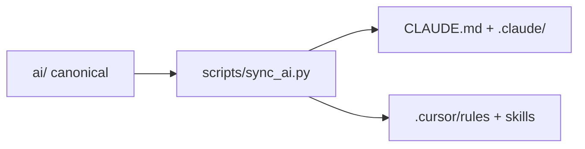

# Design — bootstrap-sdd-layer

## Layout

See `AGENTS.md` repository layout section.

## AI sync pipeline

OpenSpec opsx skills remain managed by OpenSpec CLI — not edited.

## Brownfield methodology

- Tier A ADRs: extract from code (slices 1–5)
- Tier B ADRs: workshop before implementation
- Reconciliation: `specs/reconciliation-r1.md`

## Non-goals

- API implementation
- Modifying SUMO upstream binaries
