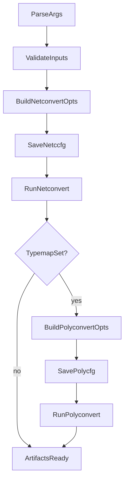
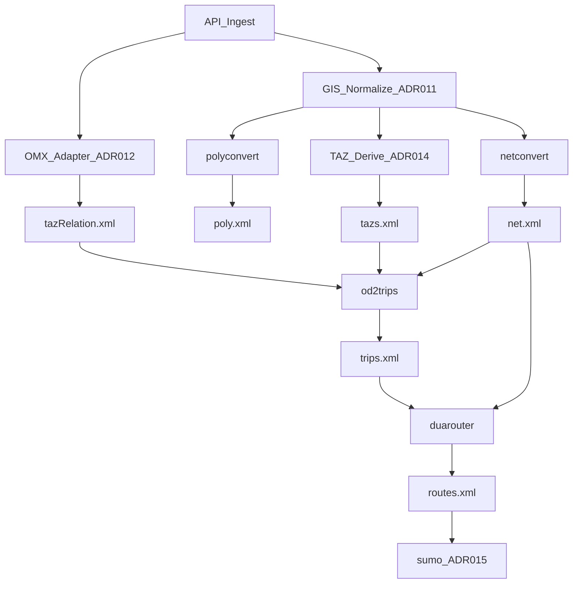

# Design — document-orchestration-slice

## osmBuild pattern (as-built)

### Key implementation details

| Concern | osmBuild approach |
|---|---|
| Binary resolution | `sumolib.checkBinary('netconvert', bindir)` |
| Options | Comma-split defaults + CLI overrides |
| Reproducibility | `--save-configuration` → `.netccfg` / `.polycfg` |
| Working directory | `subprocess.call(..., cwd=output_directory)` |
| Relative paths | `getRelative(dirname, option)` |
| Early failure | typemap file check before long netconvert run |

Source: [`tools/osmBuild.py`](../../../tools/osmBuild.py)

## Target API pipeline (MVP)

Extends osmBuild with normalization and demand:

## Design decisions (documented, not implemented here)

1. **Reuse subprocess + sumocfg pattern** — do not embed libsumo in v1 (ADR-015).
2. **Config files per step** — each binary invocation saves configuration for audit trail.
3. **Job status** — API tracks step completion (netconvert → polyconvert → omx → od2trips → duarouter → sumo).
4. **osmWebWizard** — reference for full scenario (demand + GUI) but not MVP API template.

## Non-goals

- Implementing HTTP API (ADR-008)
- OMX adapter code (ADR-012)
- Modifying osmBuild.py
