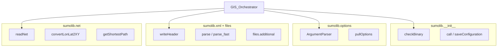
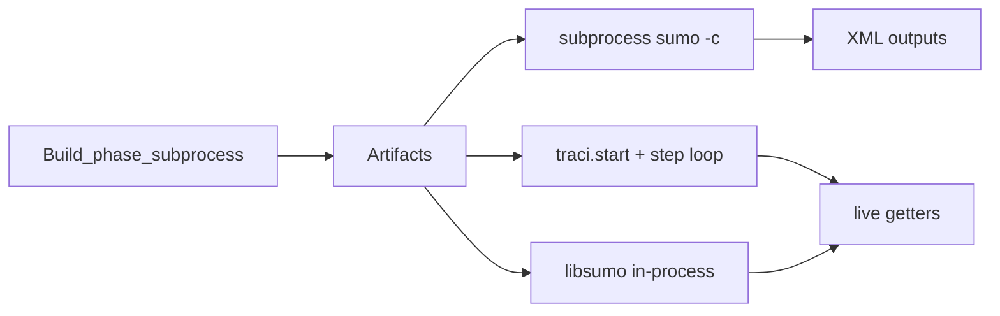

# Design — document-sumolib-traci-slice

## sumolib layers (orchestrator-facing)

### Reference script usage

| Concern | osmBuild | osmWebWizard |
|---|---|---|
| `checkBinary` | netconvert, polyconvert | sumo, sumo-gui |
| `ArgumentParser` | CLI | CLI |
| `readNet` | — | post-build edges for demand |
| `writeXMLHeader` | — | additional output config |
| `.sumocfg` | — | `sumo --save-configuration` |
| TraCI | No | No |

## TraCI vs subprocess (simulation)

**As-built default for scenario tools:** subprocess path (A). TraCI (B) used by co-simulation tools (`drtOnline.py`, `fcdReplay.py`).

## GIS API scope boundary

| In scope (import) | Out of scope |
|---|---|
| checkBinary, ArgumentParser, writeHeader, readNet | scenario/, visualization/, output/convert |
| subprocess + save-configuration pattern | Modifying sumolib/traci |
| Document TraCI for ADR-015 workshop | Implement TraCI in API v1 |

## Non-goals

- Resolving ADR-015 (workshop)
- Libsumo packaging in API container image
- TraCI test harness (slice 7)
