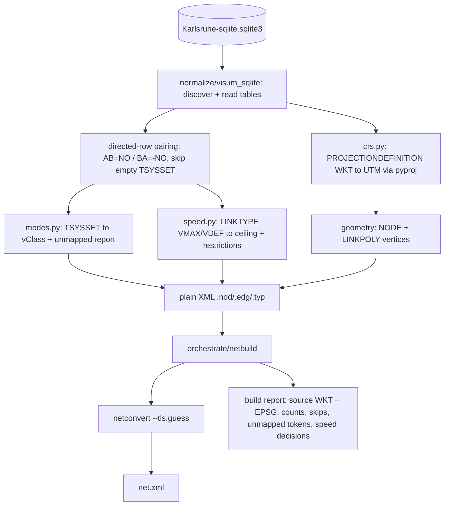

# Design: import-network-sqlite

**Change:** import-network-sqlite
**ADRs:** 006 (subprocess orchestration), 009 (placement), 011 (normalization), 013 (SQLite role)
**Companion:** `data-inventory.md` (field inventory + mapping contract — the normative source of truth)

## Context

Brownfield SUMO provides `netconvert`, which builds a `net.xml` from a **plain-XML** node/edge pair.
The GIS API is a facade + subprocess orchestrator (ADR-006) under `tools/import/gis/`. This change
adds the **SQLite path of the network-import pillar** and proves it against the real Karlsruhe DB.

Relative to the GeoJSON sibling, the SQLite export is **relational and richer**: links are stored as
directed rows (not AB+`R_*` on one feature), and `LINKTYPE` supplies per-mode speeds that eliminate the
GeoJSON `LC` speed-fallback table. AequilibraE already imports this exact DB for static assignment;
this change reuses its proven semantics (directed-row pairing, CRS-from-`PROJECTIONDEFINITION`,
`LINKPOLY` geometry, unmapped-token reporting) and diverges only where SUMO microsimulation needs more
than assignment: a positive edge speed ceiling, `vClass` permissions, lanes, and traffic control.

## Goals / Non-Goals

**Goals:**

- Library entry point: `(sqlite_path, build_options) → net.xml + build report`.
- Faithful, data-first translation of VISUM `NODE`/`LINK`/`LINKTYPE` per `data-inventory.md`.
- Positive, real per-mode-derived speed for **every** edge, including PuT-only (no fallback, no epsilon).
- Explicit CRS reprojection from the embedded sphere-Mercator WKT to a metric UTM CRS, logged.
- Validated against the real DB (counts, zero zero-speed edges, loadable net).

**Non-Goals:**

- HTTP API, jobs, workspace status (later `gis-api-http-surface`).
- Zones/TAZ, connectors, OD demand, GTFS/PT service (separate changes).
- Real signal-timing import (deferred `import-control-plan`; v1 uses `--tls.guess`).
- Per-lane `allow`, turns, capacity/volume/assignment fields.

## Decisions

### Entry point (library-first, ADR-009)

```
tools/import/gis/
  normalize/
    visum_sqlite.py    # discover/read tables → directed link & node records
    modes.py           # TSYSSET token → vClass mapping (data-inventory §4) [shared with geojson]
    speed.py           # LINKTYPE per-mode speed → edge ceiling + restrictions (data-inventory §5)
    # CRS reprojection (PROJECTIONDEFINITION WKT → pyproj) lives in visum_sqlite._make_transformer
  orchestrate/
    netbuild.py        # write plain XML, invoke netconvert, collect report [shared with geojson]
```

Public function (no HTTP):

```python
def build_network_from_sqlite(
    sqlite_path: str,
    out_dir: str,
    options: NetworkBuildOptions,
) -> NetworkBuildResult: ...
```

`NetworkBuildResult` carries `net_xml_path`, resolved source WKT + target EPSG, node/edge counts,
skipped (empty-`TSYSSET`) directions, unmapped TSys tokens, and per-edge speed/restriction decisions.
`NetworkBuildOptions` exposes `mode_mapping`, `crs` (target EPSG default 25832), and
`ignored_transport_systems`.

### Reading & normalization (ADR-011, ADR-013)

- Discover tables (case-insensitive); require `NETWORK`, `NODE`, `LINK`, `LINKTYPE`, `TSYS`; treat
  `LINKPOLY` as optional; report PT/turn/fare/zone tables as recognized-but-deferred.
- Read via stdlib `sqlite3` / pandas; reproject `NODE`/`LINKPOLY` coordinates with pyproj from the
  source WKT to the target CRS (`crs.py`).
- **Directed-row pairing (data-inventory §6):** group `LINK` by `NO`, sort by `(FROMNODENO, TONODENO)`,
  take AB = first row, BA = swapped-node row; emit `+NO` / `-NO` edges for non-empty directions only.
- `allow` from `TSYSSET` via `modes.py`; speed + restrictions via `speed.py` (joins `LINKTYPE`);
  `type` from `TYPENO` (label from `LC`); geometry = node→`LINKPOLY`→node.
- Fail loud on unreadable DB, missing required table, or missing/invalid CRS.

### Translation rules

All translation rules (mode→vClass, per-mode speed + restrictions, direction, CRS, lanes) live in
`data-inventory.md` and are the normative contract; the spec scenarios assert them against real fields.
Implementation must not silently diverge.

### netconvert build (ADR-006)

- Resolve binary via `sumolib.checkBinary('netconvert')`.
- Inputs are already-projected cartesian plain XML, so build **without** netconvert reprojection;
  add `--tls.guess`.
- Save a `.netccfg` (osmBuild pattern), capture stdout/stderr to a build log, emit `net.xml` + report.

## Architecture



## Risks / Trade-offs

| Risk | Mitigation |
|---|---|
| Sphere-Mercator → UTM reprojection introduces offset vs GeoJSON (WGS84) path | Reproject with pyproj from the embedded WKT; log source WKT + target EPSG; compare node positions in smoke test |
| Per-mode `<restriction>` may over/under-constrain microsim routing | Ceiling = fastest allowed mode; emit a `<restriction>` for every allowed `vClass` below the ceiling (resolved); tunable via `mode_mapping`; documented |
| `TRAIN→rail_urban` vs `rail` mis-set | Resolved (urban-commuter scope, data-inventory §11); configurable via `mode_mapping` |
| Node id range up to ~3×10^8 (PuT block) | Preserve verbatim as string ids; netconvert accepts; document reserved blocks |
| `--tls.guess` signals are synthetic | Documented stand-in; `CONTROLTYPE`/`SIGNALCONTROL` retained for `import-control-plan` |
| Disconnected PuT-only subnetwork | Acceptable in v1 (car OD routes on road net); revisit with PT phase |
| Shared geometry/translation code drift vs geojson sibling | `modes.py` / `netbuild.py` shared; SQLite-specific logic isolated in `visum_sqlite.py` / `crs.py` |

## Migration Plan

Greenfield. No data migration. Requires `SUMO_HOME` (for `netconvert` via `sumolib.checkBinary`) and
`pyproj`/`geopandas` already in API requirements.

## Open Questions

All six original open questions are **resolved** — see `data-inventory.md` §11 (sign-off log, dated
2026-06-18): `TRAIN→rail_urban`; restriction scope = every allowed `vClass` below the ceiling; lane
deferral + `LANE.WIDTH`; CRS = pyproj reproject to EPSG:25832; direction sign by `(FROMNODENO,
TONODENO)`; low speeds kept with a motorized-edge coherence log.
