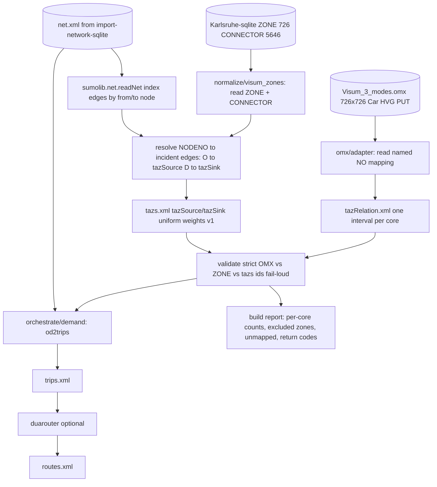

# Design: import-od-demand

**Change:** import-od-demand
**ADRs:** 005 (OD/demand pipeline), 006 (subprocess orchestration), 009 (placement), 012 (OMX adapter), 014 (TAZ alignment)
**Companion:** `data-inventory.md` (OMX + ZONE + CONNECTOR field inventory, crosswalk, and mapping contract — the normative source of truth)

## Context

Brownfield SUMO needs **three** inputs for `od2trips`: a network (`net.xml`), TAZ definitions
(`tazs.xml`), and an OD matrix (`tazRelation.xml`). `import-network-sqlite` produced `net.xml` and
**preserved VISUM ids** (`NODE.NO` → SUMO node id; `LINK.NO`/`-NO` → SUMO edge id) but deliberately
omitted `ZONE`/`CONNECTOR`. This change adds the demand package on top, as a facade + subprocess
orchestrator (ADR-006) under `tools/import/gis/`.

The data makes the SQLite `CONNECTOR` path the clear primary (data-inventory §2): the OMX `NO` mapping
equals `ZONE.NO` **exactly** (726/726), every connector node exists in `NODE`, and CAR connector nodes
resolve to `LINK` endpoints that became SUMO edges. AequilibraE imports this same DB for static
assignment and infers connectors when absent; here they are **present and exact**, so zone→edge access
is a deterministic lookup rather than a spatial guess.

## Goals / Non-Goals

**Goals:**

- Library entry point: `(omx_path, sqlite_path, net_xml, build_options) → tazRelation.xml + tazs.xml +
  build report`.
- OMX → `tazRelation` using the **named `NO` mapping** (not positional indices), one interval per core.
- `ZONE`/`CONNECTOR` → `tazs.xml` with `tazSource`/`tazSink` resolved from `CONNECTOR.NODENO` against
  the built network (`O`→source, `D`→sink); **v1 uses uniform edge weights** (connector weights ignored).
- Strict OMX↔`ZONE`↔`tazs` id alignment; fail loud on unknown zones and demand-bearing zones with no
  resolvable connector edge; report+exclude zero-demand PuT-only zones.
- `od2trips` (+ optional `duarouter`) orchestration; validated against the real OMX + DB (non-empty
  `trips.xml`).

**Non-Goals:**

- Control-plan / signal timings (`import-control-plan`).
- Full `sumo` run / demand calibration.
- `PUT` road-loading + PT line/stop modelling — **deferred**; v1 assumes scenarios 1–2 in
  `specs/future/demand-pt-scenarios.md` (PrT OMX + GTFS for PuT).
- Importing `CONNECTOR` as `function="connector"` net edges (rejected — data-inventory §9).
- New HTTP API surface / jobs / workspace status.

## Decisions

### Entry point (library-first, ADR-009)

```
tools/import/gis/
  omx/
    adapter.py     # OMX core -> tazRelation; FIX: use named mapping (NO), one interval per core, vType per core
    validate.py    # strict OMX-zone-id alignment (extend: against ZONE.NO + tazs ids, fail-loud)
  normalize/
    modes.py       # TSYS/core -> vClass (REUSED from import-network-sqlite)
    visum_zones.py # NEW: ZONE + CONNECTOR -> taz records; connector NODENO -> incident net edges
  orchestrate/
    demand.py      # NEW: write tazs.xml/tazRelation.xml, invoke od2trips (+ optional duarouter), report
```

Public function (no HTTP):

```python
def build_demand_from_visum(
    omx_path: str,
    sqlite_path: str,
    net_xml: str,
    out_dir: str,
    options: DemandBuildOptions,
) -> DemandBuildResult: ...
```

`DemandBuildResult` carries `taz_rel_path`, `tazs_path`, `trips_path` (when od2trips runs), per-core
interval/count summaries, resolved/excluded zones, unmapped cores/tokens, and the od2trips/duarouter
return codes + log paths. `DemandBuildOptions` exposes `mode_mapping`, per-core `vtype`, `skip_put`
(default true), and `emit_intrazonal` (default true). Connector weighting is **uniform in v1**
(`specs/assumptions/demand-taz-weighting-v1.md`); a future `connector_weighting` flag is deferred.

### OMX → tazRelation (ADR-012, data-inventory §3–4)

- Read with `openmatrix`; obtain `labels[index]` from the named mapping **`NO`**. If the file has no
  mapping, fall back to indices **with a reported warning** (resolve hard-fail vs warn in §10-b).
- One `<interval>` per non-empty core (`Car`,`HVG`,`PUT`), id = core name, `begin=0 end=86400` (no
  period metadata in this file). Emit `<tazRelation from to count>` for cells `> 0`; keep intrazonal
  cells by default. Validates against `datamode_file.xsd` (ADR-007).
- This **replaces** the current skeleton behavior (`f.mapping(matrix_name)` → wrong fallback to 0-based
  indices; interval id = vType). The skeleton bug is documented in data-inventory §3.

### ZONE/CONNECTOR → tazs.xml (ADR-014, data-inventory §5)

- Load `net.xml` via `sumolib.net.readNet`; index edges by `from`/`to` node id.
- For each zone, select connectors by mode (`TSYSSET` contains the mode token), map `NODENO` →
  node id, resolve incident edges: `O` → `tazSource` on out-edges, `D` → `tazSink` on in-edges.
- Restrict resolved edges to those that `allow` the target vClass (§10-e default). Assign **equal
  weight** to every deduplicated edge; do **not** read `WEIGHT(PRT)` (v1 assumption doc).
- Fail loud per data-inventory §5.4 (**external** demand only); synthesize missing O/D direction at
  zone level when needed; report+exclude intrazonal-only zones with no path; report+exclude the 28
  zero-demand PuT-only zones.

### Translation rules are normative in data-inventory.md

All mode mapping, connector→edge direction, uniform weighting (v1), intrazonal, and fail-loud rules
live in `data-inventory.md` (§4–6) and are the contract; spec scenarios assert them against **real** cores
(`Car`/`HVG`/`PUT`), zone ids (`110`, `2000115`), and connector rows. Implementation must not silently
diverge.

### od2trips / duarouter (ADR-005, ADR-006)

- Resolve via `sumolib.checkBinary`; `od2trips -n net.xml --taz-files tazs.xml -z tazRelation.xml -o
  trips.xml` (per-core vType wiring finalized at apply). Optional `duarouter -n net.xml -t trips.xml -o
  routes.xml`. Save config + build log (osmBuild pattern). Mirrors `orchestrate/pipeline.py`.

## Architecture



## Risks / Trade-offs

| Risk | Mitigation |
|---|---|
| OMX named-mapping vs positional indices mismatch (current skeleton bug) | Read mapping `NO`; assert label set == `ZONE.NO`; fixture proves labels are used, not 0-based indices |
| Demand-bearing zone with no resolvable connector edge | Fail loud naming zone + direction (data-inventory §5.4); covered by fixture |
| 28 zero-demand PuT-only zones cause false errors | Report + exclude (not error) when demand is zero (data-inventory §2.4) |
| `PUT` core has no road path (PuT stop nodes) | Default `skip_put=true` with a report; revisit in PT phase (§10-a) |
| One CAR-connector node not a `LINK` endpoint | Reported; only fails loud if a demand-bearing zone depends solely on it (data-inventory §7) |
| Connector weight fidelity vs VISUM | v1 ignores `WEIGHT(PRT)`; uniform edge selection (`specs/assumptions/demand-taz-weighting-v1.md`); revisit after calibration |
| Cars spawned on PuT-only edges at a shared node | Restrict resolved edges to those allowing the target vClass (§10-e) |
| od2trips vType wiring across multiple cores | One interval+vType per core; finalize flag wiring at apply (§10-b) |

## Migration Plan

Greenfield demand package. No data migration. Requires `SUMO_HOME` (for `od2trips`/`duarouter` via
`sumolib.checkBinary`) and `openmatrix` (already present). Consumes the `net.xml` produced by
`import-network-sqlite`.

## Open Questions

All seven open questions are listed in `data-inventory.md` §10. **(d) connector weighting** is resolved
for v1 (ignore weights, uniform edges). Remaining item pending sign-off: **(a) PuT vType + connector-set
choice**. (b)(c)(e)(f)(g) are resolved in data-inventory §10.
