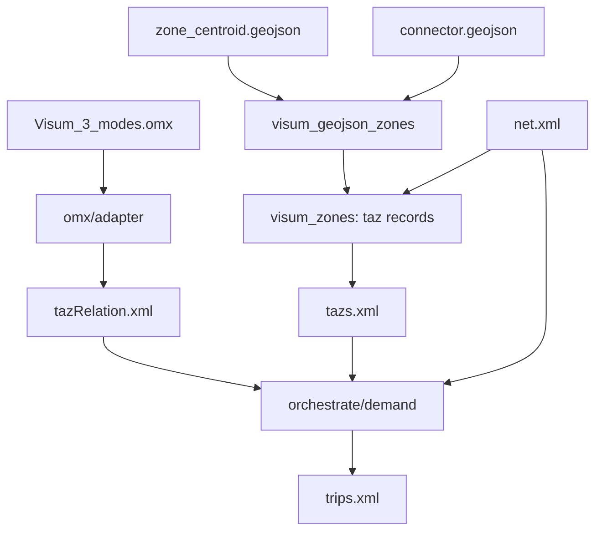

# Design: import-od-demand-geojson

**Change:** import-od-demand-geojson
**ADRs:** 005, 006, 009, 012, 014
**Companion:** `data-inventory.md` (normative mapping contract)

## Context

SUMO `od2trips` (or the fork's `reachable_trips` generator) needs `net.xml`, `tazs.xml`, and
`tazRelation.xml`. The **SQLite demand path** (`od-import-demand`) resolves TAZ access from
`CONNECTOR` rows; the **GeoJSON export carries the same connector attributes** in `connector.geojson`
with the same AB/`R_` pattern as `link.geojson`. Zone identity comes from `zone_centroid.geojson`
(726 points, `NO` = zone id). OMX matrices are source-agnostic (ADR-012).

AequilibraE documents two connector strategies: (1) use exported connector rows when present;
(2) infer connectors from zone geometry when absent. **v1 implements only (1).** (2) is deferred.

## Goals / Non-Goals

**Goals:**

- Library entry point: `(omx, zone_centroid.geojson, connector.geojson, net_xml) → tazRelation + tazs +
  trips + build report`.
- GeoJSON connector expansion → `ZoneConnectorTables` identical to SQLite reader output.
- Reuse `build_tazs_for_core_from_tables`, OMX adapter, validation, and `orchestrate/demand.py` trip stages.
- Karlsruhe smoke: `tazs.xml` parity with SQLite path for Car/HVG; non-empty reachable/od2trips output.

**Non-Goals:**

- Polygon-only TAZ derivation (`edgesInDistricts`).
- Heuristic k-nearest / centroid-based connectors.
- PUT road-loading (deferred, same as SQLite path).
- New HTTP surface.

## Decisions

### Entry point (library-first, ADR-009)

```
tools/import/gis/
  normalize/
    visum_geojson_zones.py   # NEW: zone_centroid + connector.geojson → ZoneConnectorTables
    visum_zones.py           # REFACTOR: build_tazs_for_core(tables, ...) without SQLite-only read
    modes.py                 # REUSED
  omx/                       # REUSED (adapter, validate)
  orchestrate/
    demand.py                # ADD build_demand_from_geojson(...)
```

```python
def build_demand_from_geojson(
    omx_path: str,
    zone_centroid_path: str,
    connector_path: str,
    net_xml: str,
    out_dir: str,
    options: DemandBuildOptions | None = None,
) -> DemandBuildResult: ...
```

### GeoJSON connector expansion (data-inventory §5)

One `connector.geojson` feature → up to two directed rows:

| GeoJSON (AB) | SQLite `CONNECTOR` |
|---|---|
| `ZONENO`, `NODENO`, `DIRECTION`, `TSYSSET` | same columns |
| `R_ZONENO`, `R_NODENO`, `R_DIRECTION`, `R_TSYSSET` | reverse row |

Skip a direction when `TSYSSET` / `R_TSYSSET` is empty (logged). Zone list from `zone_centroid.geojson`
`NO` (must match OMX mapping `NO`).

### TAZ → edge resolution (ADR-014 Option E)

Unchanged from `od-import-demand`: `O` → `tazSource`, `D` → `tazSink`, vClass filter, uniform weights,
direction synthesis, fail-loud on external demand without access. Implementation stays in
`visum_zones.py`; only the **connector source adapter** is new.

### OMX → tazRelation (ADR-012)

Unchanged — reuse `omx/adapter.py` and `validate.py`.

### Demand orchestration (ADR-006)

Same as `build_demand_from_visum`: per-core `tazs.xml`, `tazRelation.xml`, then `reachable` (default)
or `od2trips`, optional `duarouter`. `sumolib.checkBinary` for all subprocesses.

## Architecture



## Risks / Trade-offs

| Risk | Mitigation |
|---|---|
| GeoJSON connector drift from SQLite | Karlsruhe smoke asserts row-set equality; fixtures encode AB/`R_` rules |
| 258 zones lack polygons | Irrelevant for connector path; centroids define identity |
| GeoJSON net vs SQLite net node ids | Both preserve VISUM `NO`; use GeoJSON-built `net.xml` consistently |
| PUT connectors on stop nodes | Same deferral as SQLite path (`skip_put` default true) |

## Resolved decisions (see `data-inventory.md` §11)

| Question | Resolution |
|---|---|
| Connector source v1 | **Exported `connector.geojson` only** — no heuristics |
| Zone identity | **`zone_centroid.geojson` `NO`** — polygons diagnostic |
| OMX / mode rules | **Same as `od-import-demand`** (Car/HVG v1; PUT skipped) |
| Connector weights | **Uniform v1** (`demand-taz-weighting-v1.md`) |
