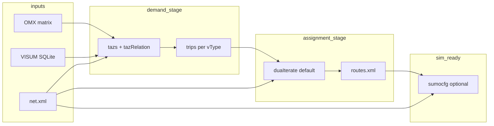

# Design — demand-assignment

**PRD:** §1, §2, §4 | **ADRs:** 005, 006, 009, 015 | **Upstream:** [Assign tools](docs/web/docs/Tools/Assign.md), [duaIterate.py](tools/assign/duaIterate.py)

## Context

`build_demand_from_visum()` in `orchestrate/demand.py` (from archived `import-od-demand`) produces
per-vType `tazs.*`, `tazRelation.*`, and `trips.*` via `od2trips`. Optional `run_duarouter=True` is
broken for multi-vType builds (repeated `-t` flags). Karlsruhe has passenger + truck trips but no
routes. Users want **macroscopic assignment upfront** (`duaIterate`) rather than static `duarouter`
alone or libsumo en-route rerouting (deferred).

Existing `workspace/paths.py` (ADR-015) defines API-oriented `inputs/`, `build/`, `logs/`, `runs/` —
not the staged layout used for local reference scenarios. This change adds a **reference layout**
without breaking the API workspace.

## Goals / Non-Goals

**Goals:**

- Single call: `(omx, sqlite, net_xml, workspace_root, options) → routes.xml` with logs and manifest.
- Default assignment: `duaIterate.py` (configurable iterations, begin/end aligned with sim horizon).
- Stable directory layout matching Karlsruhe (`network/`, `demand/`, `assignment/`, `sim/`, `sources/`).
- Manifest fingerprints; net change → rebuild assignment (v1 full rebuild).
- CLI runnable from repo root with `pip install -e` / `PYTHONPATH` documented once in package, not per user script.
- Emit minimal `sim/<name>.sumocfg` for `sumo-gui` smoke.

**Non-Goals:**

- HTTP API integration (`gis-api-mvp` GeoJSON path unchanged).
- Running `sumo` / `sumo-gui` from the library (user launches manually).
- VISUM signal / control-plan import.
- OMX temporal slicing or scenario matrices.
- Partial invalidation (only affected OD pairs or corridors).
- Editing `tools/assign/duaIterate.py` (subprocess invoke only).

## Decisions

### D1 — Layered entry point

**Decision:** Add `build_scenario_demand()` (or extend `build_demand_from_visum` with assignment
options) in `orchestrate/assignment.py`, called by `build_runnable_scenario()` in
`orchestrate/scenario.py`.

**Rationale:** Keeps `import-od-demand` library boundary (trips) intact; assignment is a separate stage
per ADR-005. Alternative: fold into `demand.py` — rejected to avoid bloating the archived module.

### D2 — Default assignment tool: `duaIterate`

**Decision:** `AssignmentOptions.method = "duaIterate"` (default), `iterations = 2` (v1 conservative;
Karlsruhe smoke may tune via CLI). Opt-in `method = "duarouter"` for fast/debug single-pass.

**Rationale:** User preference for dynamic user assignment over static macro routing; upstream docs
recommend `duaIterate` for UE-like states. `duarouter` alone is faster but mismatches stated philosophy.

**Invoke:**

```text
python <SUMO_HOME>/tools/assign/duaIterate.py -n network/net.net.xml -t demand/trips.passenger.xml,demand/trips.truck.xml -l assignment/ --begin 0 --end 7200
```

Resolve script via `sumolib.checkBinary` for `duarouter`/`sumo` and `Path(os.environ["SUMO_HOME"]) / "tools/assign/duaIterate.py"` for the Python driver (or `sys.executable` + relative path from repo when developing).

### D3 — Multi-trip CLI fix

**Decision:** For `duarouter`, use `--trip-files trips.passenger.xml,trips.truck.xml` (single option).
For `duaIterate`, use `-t` with comma-separated list (upstream accepts one `-t`).

**Rationale:** Fixes current bug in `demand.py` lines 192–194. Verified against upstream option parsers.

### D4 — Reference workspace layout

**Decision:** `ScenarioReferenceLayout` dataclass (new in `workspace/reference.py`):

| Subdir | Contents |
|--------|----------|
| `sources/` | Symlinks or copies of input OMX/SQLite (optional) |
| `network/` | `net.net.xml` (copy or symlink from build) |
| `demand/` | `tazs.*`, `tazRelation.*`, `trips.*`, od2trips logs |
| `assignment/` | `routes.xml`, `duaIterate`/`duarouter` logs, iteration dumps |
| `sim/` | `<scenario>.sumocfg`, optional `README` snippet |

`build-manifest.json` at workspace root records paths, SHA-256 of inputs (`omx`, `sqlite`, `net.xml`),
per-stage outputs, timestamps, tool versions (`sumolib.version`), and assignment method.

### D5 — Invalidation (v1)

**Decision:** Compare stored manifest hashes on rebuild:

| Change detected | v1 action |
|-----------------|-----------|
| `net.xml` hash differs, OMX/SQLite unchanged | Re-run assignment only; reuse `demand/trips.*` |
| OMX or SQLite hash differs | Re-run full demand pipeline (od2trips) + assignment |
| Assignment options differ (method, iterations, horizon) | Re-run assignment only |

**Rationale:** Full route rebuild on any net revision is acceptable v1; trips remain valid when only
edge geometry/speed/TLS guess changes if connector node ids are stable (true for `import-network-sqlite`
rebuilds). Document exception: if `ZONE`/`CONNECTOR` or OMX changes, demand must rebuild.

### D6 — CLI

**Decision:** `python -m gis.cli.build_scenario --workspace <path> --omx … --sqlite … --net …` with
sensible defaults from env vars (`KARLSRUHE_*`). Package `__main__` sets up `sys.path` internally or
documents `pip install -e tools/import` layout.

**Rationale:** Removes ad-hoc `build_routes.py` in user workspaces.

### D7 — sumocfg template

**Decision:** Minimal config: `net-file`, `route-files`, `begin=0`, `end=7200`, `time-to-teleport=300`,
optional `breakpoint` at 1800s (Karlsruhe smoke default, overridable). No additional TLS files v1.

## Pipeline (Mermaid)



## Risks / Trade-offs

| Risk | Mitigation |
|------|------------|
| `duaIterate` runtime on ~828k trips (Karlsruhe) | Document expected duration; allow `duarouter` opt-in; Karlsruhe smoke marked `@pytest.mark.slow` |
| `duaIterate` writes many iteration artifacts | Output under `assignment/`; manifest lists paths; `.gitignore` guidance in README |
| UE not guaranteed in 2 iterations | Expose `--iterations`; document upstream caveat; increase for production runs |
| Two workspace layouts (API vs reference) | Separate classes; API path unchanged |
| `SUMO_HOME` required for `duaIterate.py` path | Fail loud with explicit message (ADR-006 pattern) |

## Migration Plan

1. Implement library + CLI; run Karlsruhe workspace build to produce `assignment/routes.xml`.
2. Point `c:\tmp\karlsruhe\sim\karlsruhe.sumocfg` at generated artifacts (or regenerate via CLI).
3. Remove/deprecate local `build_routes.py` helper after CLI works.
4. Update `specs/interfaces.md` and `specs/coverage.md` during apply/archive.

## Open Questions

- **Iterations default for Karlsruhe:** start with `2` in spec; tune after first successful smoke.
- **Trip sampling for dev smoke:** optional `--max-trips` flag deferred unless first run is impractical.
