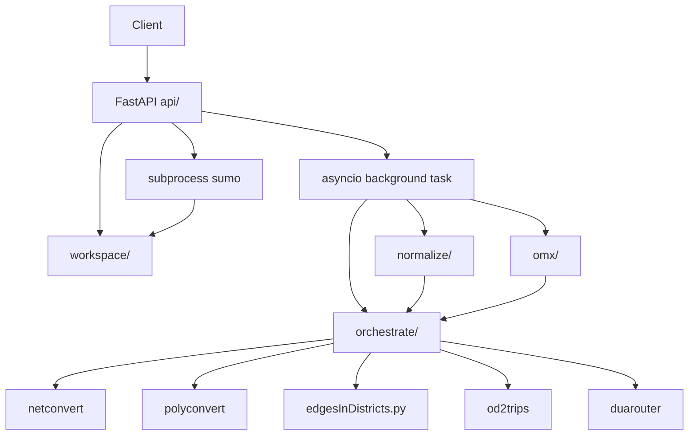

# Design: gis-api-mvp

**Change:** gis-api-mvp
**ADRs:** 008–015

## Context

Brownfield SUMO provides netconvert, polyconvert, od2trips, duarouter, sumo, and `tools/edgesInDistricts.py`. The GIS API is a facade + orchestrator (ADR-006) in `tools/import/gis/`. Tier B workshop fixed stack (FastAPI + asyncio jobs + Docker), REST contract, normalization library, OMX adapter, strict TAZ ids, and subprocess simulation.

## Goals / Non-Goals

**Goals:**

- Implement PRD §3 journeys 1–4 via ADR-010 routes.
- End-to-end MVP: spatial inputs + OMX → `.net.xml`, demand, routes, optional simulation run.
- Filesystem workspace per scenario with `status.json` job tracking.
- Fail loud on CRS, schema, OMX/TAZ mismatches (PRD §4).

**Non-Goals:**

- Authentication, rate limiting, S3 storage (deferred).
- TraCI / libsumo / libtraci simulation (ADR-015 v2).
- Fuzzy centroid-in-polygon TAZ matching (ADR-014 v2).
- C++ importer changes or upstream tool edits.

## Decisions

### Package layout (ADR-009)

```
tools/import/gis/
  __init__.py
  api/           # FastAPI app, routes, models
  normalize/     # geopandas/pyogrio readers, CRS, exports
  omx/           # openmatrix → tazRelation
  orchestrate/   # build pipeline, subprocess helpers
  workspace/     # scenario dirs, status.json, artifact paths
tests/tools/import/gis/
```

### HTTP + jobs (ADR-008)

- **FastAPI** with **asyncio background tasks** for build and run steps.
- `POST /v1/scenarios` writes uploads to workspace, returns UUID, enqueues `orchestrate.build_scenario`.
- `status.json` states: `pending` → `building` → `ready` | `failed`; runs use `running` → `completed` | `failed`.
- **Uvicorn** in Docker; `GIS_API_WORKSPACE` env for root path.

### Normalization (ADR-011, ADR-013)

- **geopandas + pyogrio** read GeoJSON, GPKG (`?layer=`), SpatiaLite tables.
- Plain SQLite attribute tables joined via `build_options.sqlite_joins`.
- Auto-detect CRS; optional `build_options.crs` override; reproject to network CRS before netconvert; log transforms.
- Export temp shapefile/GeoJSON for binary inputs; delete temps after successful build or on failure cleanup.

### Demand path (ADR-012, ADR-014)

- **openmatrix** reads OMX → **tazRelation XML** with interval mapping per matrix slice.
- Zone polygons from default layer **`zones`** → **edgesInDistricts.py** → `tazs.xml`.
- **Strict** OMX zone id = polygon `id`/`zone_id`; reject unknown ids.

### Orchestration (ADR-006)

- `sumolib.checkBinary` for all binaries; save `.netccfg`/`.polycfg` like osmBuild.
- Sequence per `specs/interfaces.md` target API sequence diagram.

### Simulation (ADR-015)

- Generate `.sumocfg` under `runs/{run_id}/`; `subprocess` `sumo -c …`.
- Collect `tripinfos.xml`, `summary.xml` into run artifact list.

### Container

- Dockerfile: SUMO release binaries, GDAL, Python deps, `GIS_API_WORKSPACE=/data/scenarios`.
- Single-container v1; volume mount for workspace persistence.

## Architecture



## Risks / Trade-offs

| Risk | Mitigation |
|---|---|
| GPKG via pyogrio unverified | Early integration test; explicit error on read failure |
| Long builds block worker | v1 single-process background tasks; document polling; Celery later |
| Large uploads (500 MB) | Stream to disk; reject > limit with 413 |
| Workspace disk growth | Document cleanup policy; scenario delete endpoint in v2 |
| OMX multi-slice complexity | Start with single-matrix tests; interval mapping tested per ADR-012 |

## Migration Plan

Greenfield — no migration. Deploy container with `SUMO_HOME` and mounted workspace volume.

## Open Questions

- Minimum netconvert options for GeoJSON-derived road layers (typemap defaults).
- Whether v1 includes `DELETE /v1/scenarios/{id}` for workspace cleanup (optional stretch).
