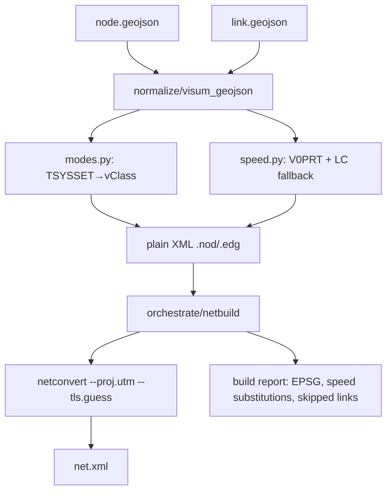

# Design: import-network-geojson

**Change:** import-network-geojson
**ADRs:** 006 (subprocess orchestration), 009 (placement), 011 (normalization)
**Companion:** `data-inventory.md` (field inventory + mapping contract — the source of truth for translation rules)

## Context

Brownfield SUMO provides `netconvert`, which can build a `net.xml` from a **plain-XML** node/edge
pair and project geographic coordinates to a metric CRS. The GIS API is a facade + subprocess
orchestrator (ADR-006) under `tools/import/gis/`. This change implements only the **first pillar of
the `gis-api-mvp` epic** — turning a VISUM GeoJSON network export into a SUMO network — and proves it
against the real Karlsruhe files.

## Goals / Non-Goals

**Goals:**

- Library entry point: `(node.geojson, link.geojson, build_options) → net.xml + build report`.
- Faithful, data-first translation of VISUM links/nodes per `data-inventory.md`.
- PuT-only links preserved as permission-restricted edges (no epsilon hack).
- Explicit, logged CRS projection (auto-UTM).
- Validated against the real files (counts, zero 0-speed edges, loadable net).

**Non-Goals:**

- HTTP API, jobs, workspace status (later `gis-api-http-surface`).
- SQLite source, zones/TAZ, OD, GTFS (separate changes).
- Real signal-timing import (deferred `import-control-plan`; v1 uses `--tls.guess`).
- Capacity/volume/assignment fields (not needed to build a runnable net).

## Decisions

### Entry point (library-first, ADR-009)

```
tools/import/gis/
  normalize/
    visum_geojson.py   # read node/link GeoJSON → normalized records
    modes.py           # TSYSSET token → vClass mapping (data-inventory §4)
    speed.py           # V0PRT parse + fallback by LC (data-inventory §5)
  orchestrate/
    netbuild.py        # write plain XML, invoke netconvert, collect report
```

Public function (no HTTP):

```python
def build_network_from_geojson(
    nodes_path: str,
    links_path: str,
    out_dir: str,
    options: NetworkBuildOptions,
) -> NetworkBuildResult: ...
```

`NetworkBuildResult` carries `net_xml_path`, resolved EPSG, edge/node counts, and the list of
speed substitutions and skipped (empty-`TSYSSET`) links.

### Normalization (ADR-011)

- Read both GeoJSON files with geopandas/pyogrio (or stdlib json — small, flat properties).
- Build SUMO **plain XML**: `*.nod.xml` (id, x=lon, y=lat) and `*.edg.xml`
  (id, from, to, numLanes, speed, allow, type, shape).
- One VISUM link row → AB edge (`NO`) and/or reverse edge (`-NO`) per direction rule.
- `allow` from `TSYSSET` via `modes.py`; speed via `speed.py`; `type` = `LC` (fallback `TYPENO`).
- Fail loud on unreadable input or unmapped CRS.

### Translation rules

All translation rules (mode→vClass, speed fallback, direction, CRS) live in `data-inventory.md`
and are the normative contract; the spec scenarios assert them. Implementation must not silently
diverge from that document.

### netconvert build (ADR-006)

- Resolve binary via `sumolib.checkBinary('netconvert')`.
- Invoke with plain-XML inputs, `--proj.utm` (auto-UTM, EPSG:25832 for Karlsruhe), `--tls.guess`.
- Save a `.netccfg` (osmBuild pattern) and capture stdout/stderr into a build log.
- Output `net.xml` + build report in `out_dir`.

## Architecture



## Risks / Trade-offs

| Risk | Mitigation |
|---|---|
| PuT speed absent in GeoJSON → fallback may be wrong | Log every substitution; real values arrive via `import-network-sqlite` |
| `--tls.guess` signals are synthetic, not real | Documented stand-in; `CONTROLTYPE` retained for `import-control-plan` |
| Node id range `1xxxxx` collides with future synthetic ids | Preserve VISUM ids verbatim; document the reserved block |
| Disconnected PuT-only subnetwork | Acceptable in v1 (OD routes on car net); revisit with GTFS |
| netconvert geo-projection flags | Pin exact flags during apply; verify resolved EPSG in report |

## Migration Plan

Greenfield. No data migration. Requires `SUMO_HOME` (for `netconvert` via `sumolib.checkBinary`).

## Open Questions

- `TRAIN` → `rail` vs `rail_urban` (see data-inventory §4).
- Whether any shared-corridor links should be merged into multi-`allow` lanes vs kept as separate
  edges (default: separate edges).
- Floor for very low real speeds (`2km/h`) — default: keep as-is.
