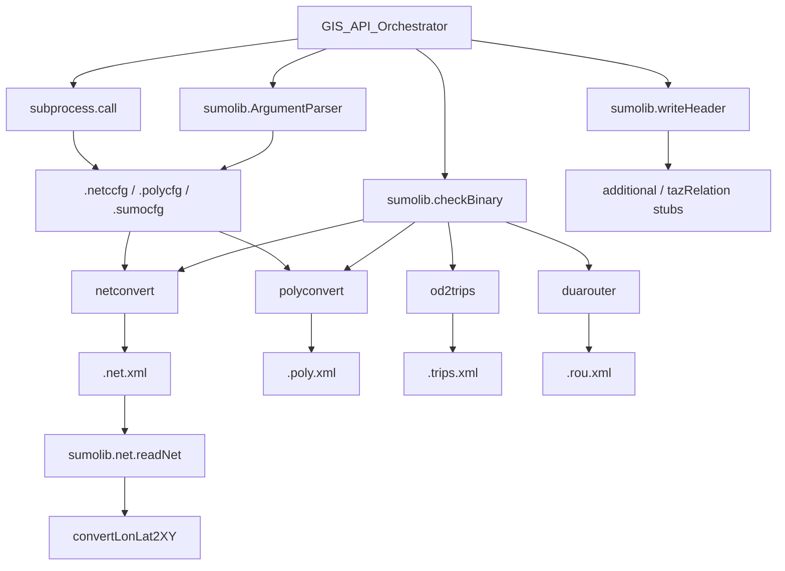
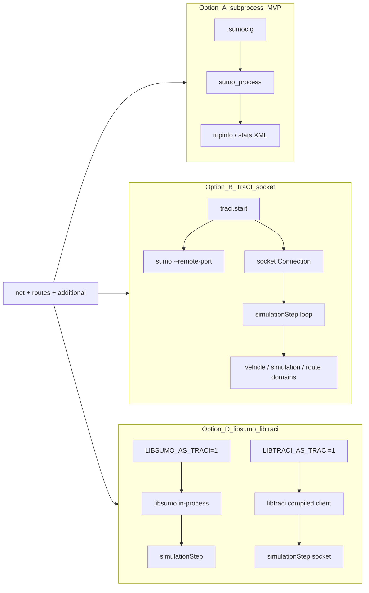

# ADR-006: Python Orchestration Pattern

**Status:** Accepted (documented from code)
**Tier:** A
**Sources:** `tools/osmBuild.py`, `tools/osmWebWizard.py`, `tools/sumolib/`, `tools/traci/`

## Context

The GIS API orchestrates SUMO binaries rather than reimplementing import logic. `osmBuild.py` is the canonical single-format orchestration reference. Slice 6 documents the **sumolib** and **TraCI** libraries that orchestrators and simulation runners import (read-only upstream).

## Decision

### As-built pattern (`osmBuild.py`)

1. Parse options via `sumolib.options.ArgumentParser`.
2. Resolve binaries: `sumolib.checkBinary('netconvert', bindir)`, `polyconvert`.
3. Build option lists from comma-separated defaults (`DEFAULT_NETCONVERT_OPTS`).
4. Early validation: input file exists, output directory exists, vehicle class valid.
5. Run `netconvert` with `--save-configuration` → `.netccfg`, then `netconvert -c`.
6. If typemap provided: run `polyconvert` similarly → `.polycfg`, output `.poly.xml`.
7. Use `cwd=output_directory` with relative paths via `getRelative()`.

**Key defaults:**

```python
DEFAULT_NETCONVERT_OPTS = (
    '--geometry.remove,--ramps.guess,--junctions.join,'
    '--tls.guess-signals,--tls.discard-simple,--tls.join,--output.original-names,'
    '--output.street-names'
)
```

**Not in osmBuild (API must add):**

- od2trips, duarouter, OMX adapter, GIS normalization, HTTP layer.
- `osmWebWizard.py` adds demand generation and GUI launch — broader scenario template.

**sumolib responsibilities (slice 1 summary):**

- Binary discovery (`SUMO_HOME`, `bindir`)
- Options parsing
- Subprocess orchestration (caller's responsibility)

---

## sumolib API surface for orchestrators

Upstream package: `tools/sumolib/` (import only — read-only for fork). User manual: `docs/web/docs/Tools/Sumolib.md` (point, don't duplicate).

### Binary resolution and subprocess (`__init__.py`)

| API | Location | Role |
|---|---|---|
| `checkBinary(name, bindir=None)` | `tools/sumolib/__init__.py:54–93` | Resolve executable path |
| `call(executable, args)` | `tools/sumolib/__init__.py:40–51` | Build argv from namespace; `subprocess.call` |
| `saveConfiguration(executable, configoptions, filename)` | `tools/sumolib/__init__.py:35–37` | Set `save_configuration` then invoke binary |

**`checkBinary` resolution order** (first hit wins):

1. Environment variable `<NAME>_BINARY` (or `GUISIM_BINARY` for `sumo-gui`)
2. `bindir` argument
3. `$SUMO_HOME/bin/<name>`
4. Installed `sumo` Python wheel (`sumo.SUMO_HOME`)
5. Relative `tools/../../bin/<name>` from sumolib install path
6. Debug variant (`name + "D"`) recursive fallback
7. Return bare `name` (relies on PATH)

Tests confirm `SUMO_BINARY` / `SUMO_HOME` behaviour: `tests/tools/sumolib/init/runner.py`.

**Subprocess patterns in reference orchestrators:**

| Script | Pattern | Config save |
|---|---|---|
| `osmBuild.py` | Raw `subprocess.call(argv + ["--save-configuration", cfg], cwd=…)` then `subprocess.call([binary, "-c", cfg], cwd=…)` | `.netccfg`, `.polycfg` |
| `osmWebWizard.py` | `subprocess.call([sumo, …, "--save-configuration", config], cwd=tmp)` for `.sumocfg` | `.sumocfg` |

`sumolib.saveConfiguration` and `sumolib.call` are **alternative** helpers; osmBuild/osmWebWizard use direct `subprocess.call` with CLI flags — both are valid upstream patterns.

### CLI and configuration (`options.py`)

| API | Location | Role |
|---|---|---|
| `ArgumentParser` | `tools/sumolib/options.py:161+` | argparse + SUMO config file support (`-c`, `-C`, `--save-template`) |
| `pullOptions(executable, argParser, …)` | `tools/sumolib/options.py:88–90` | Populate parser from `executable --save-template` XML |
| `readOptions(filename)` | `tools/sumolib/options.py:155–158` | Parse saved `.netccfg` / `.sumocfg` XML into `Option` tuples |

`pullOptions` runs `subprocess.check_output([executable, "--save-template", "-"])` and SAX-parses the template — same metadata source as binary `--help` groups. `ArgumentParser` writes saved configs via `openz` and embeds a generation comment (`options.py:277–278`).

GIS API orchestrator SHOULD use `ArgumentParser` for CLI parity and MAY use `pullOptions` when exposing per-binary options dynamically.

### Network model (`net/`)

| API | Location | Role |
|---|---|---|
| `readNet(filename, **kwargs)` | `tools/sumolib/net/__init__.py:1106+` | Load `.net.xml` → `Net` object (lxml or SAX) |
| `Net.getShortestPath` / `getFastestPath` / `getOptimalPath` | `tools/sumolib/net/__init__.py:603, 776, 796` | In-memory routing on parsed net |
| `Net.convertLonLat2XY` / `convertXY2LonLat` | `tools/sumolib/net/__init__.py:562–575` | CRS transform when net has geo-projection + `pyproj` |
| `Net.hasGeoProj` / `getGeoProj` | `tools/sumolib/net/__init__.py:537–552` | Requires `<location projParameter="…">` in net |

`osmWebWizard.py:343` uses `sumolib.net.readNet(…).getEdges()` after build for demand (randomTrips edge list) — pattern GIS API may reuse for post-build validation or TAZ edge assignment (ADR-014).

**GIS relevance:** Coordinate transforms for API responses belong in `sumolib.net` when a `.net.xml` exists; raw 2D geometry helpers are separate (see `geomhelper`).

### XML I/O (`xml/`)

| API | Location | Role |
|---|---|---|
| `writeHeader` / `buildHeader` | `tools/sumolib/xml/__init__.py:30–74` | XSD-linked XML header + generation comment |
| `parsing.*` | `tools/sumolib/xml/parsing.py` | `parse`, `parse_fast`, structured readers |
| `xsd.XsdStructure` | `tools/sumolib/xml/xsd.py` | Load XSD for structured parsing |

`osmWebWizard.py:469` writes `additional` XML via `sumolib.writeXMLHeader`. Fork-generated artifacts SHOULD use `writeHeader` for ADR-007 consistency.

### Files, shapes, routes (`files/`, `shapes/`, `route.py`)

| Module | Role | GIS API relevance |
|---|---|---|
| `files/additional.py` | Write `<additional>` XML | TAZ, detectors, edgeData stubs |
| `shapes/polygon.py`, `shapes/poi.py` | Parse/write polygon and POI elements | Consumes polyconvert `.poly.xml` structure |
| `route.py` | Route length, stop handling on `Net` | Demand validation, not orchestration |
| `vehicletype.py` | Vehicle type XML helpers | Demand pipeline |

**Out of scope for GIS API v1:** `scenario/`, `visualization/`, `output/convert/*`, `net/generator/*` (test fixtures and tooling, not orchestration).

### Geometry helpers (`geomhelper.py`)

Pure 2D computational geometry (distance, polygon intersection, shape offsets). **Not** CRS projection — use `Net.convertLonLat2XY` when geo-referenced. API normalization layer (ADR-011) may use `geomhelper` for pre-netconvert spatial predicates.

---

## TraCI vs Libsumo — simulation control plane

Upstream TraCI client: `tools/traci/`. Manuals: `docs/web/docs/TraCI/index.md`, `docs/web/docs/Tools/traci.md`, `docs/web/docs/Libsumo.md`.

### Default import path (`tools/traci/__init__.py:41–59`)

```text
if LIBSUMO_AS_TRACI / LIBTRACI_AS_TRACI env set → import libsumo / libtraci
else → import tools/traci/main.py (pure Python, socket TraCI)
```

Pure-Python TraCI reports `isLibsumo() == False`, `isLibtraci() == False` (`main.py:162–167`). Libsumo is in-process (no socket); libtraci is API-compatible socket client compiled with SUMO.

### Connection lifecycle (`main.py`, `connection.py`)

| Entry | Use case |
|---|---|
| `traci.start(cmd, port=None, label="default", …)` | Socket TraCI: `subprocess.Popen(cmd + ["--remote-port", port])` then `connect` (`main.py:122–159`) |
| `libsumo.start(cmd, …)` | Libsumo (in-process): same `traci` import when `LIBSUMO_AS_TRACI=1`; no socket or `connect` — see glossary **Libsumo**, `docs/web/docs/Libsumo.md` |
| `traci.connect` / `traci.init` | Socket TraCI only: attach to already-running `sumo` with `--remote-port` |
| `traci.simulationStep(step=0)` | Advance simulation; `step=0` = one step (`main.py:194–200`, `connection.py:359–378`) |
| `traci.close(wait=True)` | Send close command; optionally wait on sumo process |
| `traci.load(args)` | Hot-reload scenario on open connection (`connection.py:351–357`) |

Port selection: `sumolib.miscutils.getFreeSocketPort()` when `port` omitted (`main.py:141`).

**Connection pool:** labelled connections (`default`, custom labels), `traci.switch(label)`, `traci.getConnection(label)`. `init` is not thread-safe (`main.py:109–114`).

### Domain modules (MVP monitoring subset)

Full domain list: `tools/traci/main.py:53–76`. For GIS API **monitoring** (post-MVP / ADR-015 Option B), prioritize:

| Domain | Module | Typical use |
|---|---|---|
| `simulation` | `_simulation.py` | Time, loaded state, stage info |
| `vehicle` | `_vehicle.py` | Counts, positions, subscriptions |
| `route` | `_route.py` | Route IDs, edges |

GUI domain (`_gui.py`) only when `sumo-gui` is running; `connection.hasGUI()` probes via `gui.getIDList()` (`connection.py:344–349`).

### Error model (`exceptions.py`)

| Exception | Semantics |
|---|---|
| `TraCIException` | Command failed; connection intact (`exceptions.py:69–82`) |
| `FatalTraCIError` | Connection lost or protocol error; includes `check()` when not connected (`connection.py:43–46`) |

### Reference tools — which path they use

| Tool | sumo launch | TraCI |
|---|---|---|
| `osmBuild.py` | — | No |
| `osmWebWizard.py` | `subprocess.call([sumo, "-c", config])` or `sumo-gui` (`osmWebWizard.py:736, 498`) | **No** |
| `tools/drt/drtOnline.py` | `traci.start(…)` | Yes |
| `tools/fcdReplay.py`, `tools/stateReplay.py` | `traci.start(…)` | Yes |

**Conclusion:** Canonical scenario builders use **subprocess + `.sumocfg`**, not TraCI. TraCI is for co-simulation, online control, and step-by-step monitoring.

### GIS API implications (fork — Tier B: ADR-015)

| Concern | Reuse (upstream) | Fork builds | Out of scope |
|---|---|---|---|
| Binary / config orchestration | `sumolib.checkBinary`, `ArgumentParser`, `writeHeader`, subprocess + `--save-configuration` | `.sumocfg` authoring, job step tracking | Patching sumolib |
| Post-build net inspection | `readNet`, geo conversion, routing helpers | API geo responses tied to scenario net | Net generators |
| Shape artifacts | `shapes/*` parsers | Serve polyconvert outputs | polyconvert internals |
| Simulation run (v1 recommendation) | `subprocess` `sumo -c scenario.sumocfg` (osmWebWizard pattern) | Scenario output dir, tripinfo/stats paths | — |
| Live control / subscriptions | `traci` socket client (default) | **Deferred** unless workshop picks ADR-015 Option B/D | Full TraCI domain surface |
| In-process simulation | `libsumo` via `LIBSUMO_AS_TRACI` | **Workshop** — multiprocessing constraints per upstream docs | libsumo GUI on Windows |

---

## Architecture diagrams

### Subprocess orchestration (build phase — slices 1–5 + sumolib)



### Simulation control plane (run phase — ADR-015 options)



---

## Consequences

- New API orchestrator follows osmBuild structure: validate → config files → subprocess → artifacts.
- Extend with demand pipeline steps per `specs/interfaces.md` target sequence.
- `.sumocfg` generation follows osmWebWizard: invoke `sumo` with `-n`, `-r`, `-a`, output flags, and `--save-configuration` (`osmWebWizard.py:452–480`).
- TraCI integration is **optional** and **downstream of ADR-015**; sumolib remains the primary dependency for build orchestration.
- Socket TraCI (`tools/traci/main.py`) is **upstream** — covered by `tests/complex/traci/` and `tests/traci/` (no `tests/tools/traci/`). Libsumo CI: `test-wheels.yml` → `-a complex.libsumo` with `config.complex.libsumo`; libtraci overlay in `config.complex.libtraci`. Fork adoption of Option D remains **`unverified`** until ADR-015 (see `specs/test-strategy.md` § TraCI).

## References

- PRD §1, §3, §5
- ADR-007 (XML/XSD), ADR-015 (simulation execution)
- OpenSpec: `document-orchestration-slice`, `document-sumolib-traci-slice`
- Upstream: `docs/web/docs/Tools/Sumolib.md`, `docs/web/docs/TraCI/index.md`, `docs/web/docs/Libsumo.md`
