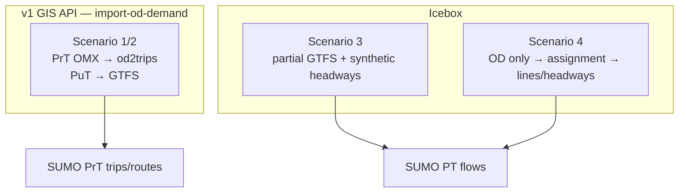

# Demand scenarios — private OD vs public transport supply

**Status:** `candidate` (scenarios 1–2 chosen for GIS API v1; 3–4 documented for later)  
**PRD:** §2 (MVP inputs), §6 (runnable scenarios)  
**Related:** `import-od-demand` (PrT OMX path), ADR-005, ADR-012, ADR-014  
**Companion (AE fork):** `C:\tmp\aequilibrae\docs\backlog.md` — assignment validation stage

SUMO is naturally **dual**: zone OD + free routing for private traffic; **lines + headways/timetable**
for public transport. VISUM MODE `PuT` (OMX core `PUT`) is an **aggregated macro bag** — not a link
mode and not a native SUMO PT input. See discussion in `import-od-demand` data-inventory §6 / §10(a).

---

## Chosen for v1 (scenarios 1 and 2 — equivalent for implementation)

### Scenario 1 — Private OD + public GTFS

| Layer | Source | SUMO mechanism |
|---|---|---|
| **PrT** (car, HGV, …) | OMX slices + zones/connectors | `tazRelation` + `tazs` → `od2trips` → `duarouter` |
| **PuT** (bus, tram, train) | **GTFS** (routes, stops, headways or timetable) | SUMO public-transport flows / schedule — **not** `od2trips` |

**Reconciliation focus:** same network graph, zone ids, stop ↔ edge attachment across sources.

### Scenario 2 — Full OD export + full GTFS (discard PuT OMX for injection)

Same implementation as scenario 1 for SUMO:

- **Keep** private OMX cores (`Car`, `HVG`, …) for the PrT path.
- **Reject / do not inject** the `PUT` OMX slice via `od2trips`.
- The PuT matrix may still be used **upstream** (assignment, calibration, total-demand checks) — but
  not as a direct SUMO demand file.

**`import-od-demand` v1 scope:** scenarios 1–2 — PrT only; `PUT` out of scope (see change proposal).

---

## Future scenarios (icebox)

### Scenario 3 — OD + partial GTFS (lines/topology, no timetables)

**Inputs:** PrT OMX + GTFS with routes/stops but **missing** headways or full timetable.

**Idea:**

- Use GTFS for **topology** (routes, stop sequence, mode type).
- **Synthesize** headways or vehicle counts from heuristics, e.g.:
  - assumed vehicle capacity × target occupancy (valley / peak),
  - regional PuT totals from OMX or counts,
  - optional AequilibraE transit assignment → line volumes → implied frequency.

**Open questions:** occupancy priors per city; peak spreading; how to validate without sensors.

**Promotes to:** e.g. `import-pt-gtfs-synthetic-schedule` or AE → SUMO PT flow exporter.

---

### Scenario 4 — OD only (no GTFS)

#### 4a — OD split by mode (separate OMX cores per TSYS)

If the export provides **separate** matrices (e.g. `Car`, `HGV`, `Bus`, `Tram`, `Train`):

- PrT-like cores → `od2trips` path (with correct vType and tazs).
- Road-running bus could use od2trips; **true** tram/rail still wrong without lines — prefer PT
  supply when available.

#### 4b — OD with PuT bag only (`PUT` / MODE PuT)

**Problem:** macro PuT demand with **no** line supply in the federated package.

**Idea (multi-step):**

1. Build or import a **transit network** (lines/routes) — from VISUM export, OSM, or inferred.
2. Run **transit assignment** (AequilibraE `TransitAssignment` or equivalent) with the PuT OMX.
3. Derive **line volumes** and **headways** (or explicit flows) for SUMO PT.
4. Optional research path: post-assignment **OD disaggregation** by `route_type` (bus/tram/rail) for
   od2trips — **not** in AE today; likely worse than line-flow handoff.

**Open questions:** VISUM transport-system-based vs headway vs timetable assignment parity; federated
zone ↔ stop reconciliation without VISUM connectors.

**Promotes to:** AE assignment → SUMO PT exporter; or VISUM line export adapter.

---

## Scenario map

---

## References

- Upstream SUMO PT: `docs/web/docs/Simulation/Public_Transport.md`
- VISUM PuT procedures (lines optional): PTV help — transport system-based vs headway vs timetable assignment
- Fork assumption (uniform taz weights v1): `specs/assumptions/demand-taz-weighting-v1.md`
- AequilibraE PuT notes (future): `aequilibrae/docs/future/put-demand-sumo-handoff.md` — agent prompt: `aequilibrae/docs/future/AGENT-PROMPT-put-sumo-bridge.md`
