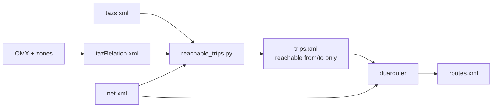

# Demand routing — SUMO alternatives to od2trips + fixed from/to

**Status:** `candidate` (option 1 implemented in fork as default trip generation)  
**PRD:** §6 (runnable scenarios), demand assignment quality  
**Related:** `import-od-demand`, `demand-assignment`, ADR-012, `specs/assumptions/demand-taz-weighting-v1.md`  
**Upstream:** `docs/web/docs/Demand/Importing_O/D_Matrices.md`, `docs/web/docs/Demand/Shortest_or_Optimal_Path_Routing.md`, `docs/web/docs/duarouter.md`, `docs/web/docs/Definition_of_Vehicles,_Vehicle_Types,_and_Routes.md` § TAZ

---

## Current v1 pipeline

1. **`reachable_trips` (fork, default)** — for each OMX cell, precomputes viable `(tazSource, tazSink)` pairs via `sumolib` shortest paths; samples only from those pairs. Fails loud when a demand-bearing O–D pair has no viable connector pair.
2. **`od2trips` (opt-in)** — legacy upstream sampler (`DemandBuildOptions.trip_generation="od2trips"`).
3. **`duarouter`** — shortest-path routing between fixed `from`/`to` edges.

Connector hygiene (e.g. skip dead-end `tazSource` edges) is enforced when building `tazs.xml` in the GIS fork, not inside SUMO binaries.

---

## What SUMO can do (not used in v1)

| Mechanism | Behavior | Why we skip it (v1) |
|---|---|---|
| Trips with **`fromTaz` / `toTaz` only** (no `from`/`to`) fed to **duarouter** | duarouter selects source/sink edges to **minimize travel time** between TAZs (empty-network times by default) | VISUM path already materializes edges in `od2trips`; switching would change stochastic edge choice semantics and require revisiting OMX → trip generation |
| **`--ignore-errors`** on duarouter | Skip unroutable trips, continue assignment | Hides data/network defects; rejected for production-quality runnable scenarios |
| **`--repair` / `--repair.from`** | Try to fix invalid start/end edges on **existing routes** | Repairs broken routes, not full O–D replanning from OMX; does not replace connector validation |
| **TAZ routing inside `sumo`** (rerouting device) | Dynamic edge choice using **current** network travel times | Post-assignment / online routing; out of scope for offline `build_scenario` |
| **Junction TAZ** (`fromJunction` / `toJunction`, `--junction-taz`) | Route between junctions with implicit edge sets | Different connector model than VISUM zone centroids; needs design if promoted |

Upstream note (paraphrased): TAZ edge selection in **duarouter** / **sumo** minimizes travel time; in **od2trips** it follows a **probability distribution** — these are intentionally different.

---

## Candidate improvements (if promoted)

1. ~~**Reachability-aware trip generation**~~ — **implemented** in `tools/import/gis/orchestrate/reachable_trips.py` (default `trip_generation="reachable"`).
2. **Defer edge choice to duarouter** — emit `fromTaz`/`toTaz` trips only; travel-time-minimizing connectors.
3. **Optional `--ignore-errors` mode** — documented “best effort” assignment for exploration only, never default for `build_scenario`.
4. **Weighted connectors aligned with VISUM** — replace uniform `tazSource`/`tazSink` weights when SQLite provides split factors (see `demand-taz-weighting-v1` assumption).

**Promotes to:** e.g. `demand-routing-quality` or amend `demand-assignment` after modeller sign-off.

---

## References

- Karlsruhe dead-end connector post-mortem: zone `1000018`, edge `-550081510` (invalid) vs `-550081505` (valid) — fixed in `visum_zones.py` origin filter.
- Fork connector rule: O = edges with `outgoing > 0`; D = edges with `incoming > 0`.
