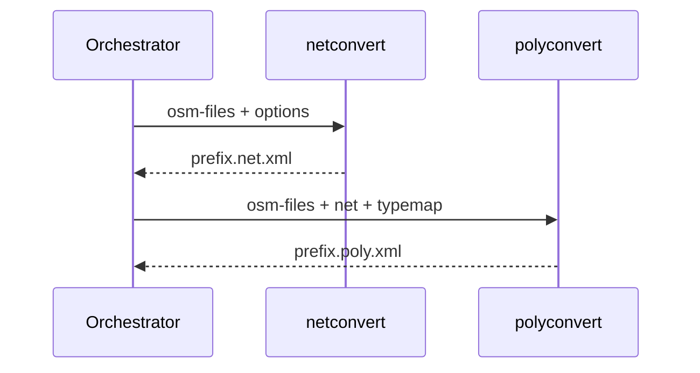
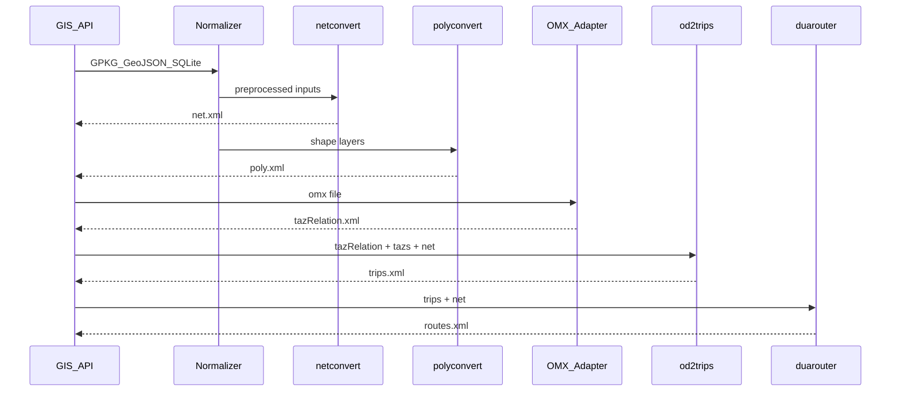

# Interface Registry — SUMO GIS API

Cross-module data contracts. Update when slices complete or implementations change.
Status: `upstream` (existing SUMO), `partial` (exists but incomplete for MVP), `gap` (must be built), `unverified` (hypothesis).

| Interface | Format | Producer | Consumer | Status | Notes |
|---|---|---|---|---|---|
| Network | `.net.xml` | netconvert | sumo, duarouter, polyconvert | upstream | Primary road graph |
| Shapes / additional | `.poly.xml` | polyconvert | sumo-gui | upstream | POIs, polygons |
| TAZ definitions | `tazs` XML | netedit, edgesInDistricts.py | od2trips | upstream | Required for OD demand |
| OD relations | `tazRelation` XML | netedit, route2OD.py, **OMX adapter** | od2trips, routeSampler | partial | OMX path is **gap** |
| Trips | `.trips.xml` | od2trips, randomTrips.py | duarouter | upstream | |
| Routes | `.rou.xml` | duarouter | sumo | upstream | |
| SUMO config | `.sumocfg` | API orchestrator | sumo | gap | API-generated |
| GDAL vector layer | GPKG/GeoJSON/SHP | External GIS | polyconvert; netconvert (lines) | upstream | GPKG via GDAL **unverified** |
| OMX matrix | `.omx` | External planning tools | **OMX adapter** → tazRelation | **gap** | No native SUMO reader |
| SQLite spatial | SpatiaLite / tables | External | API normalization | **unverified** | ADR-013 |
| Typemap | `.typ.xml` | `data/typemap/` | netconvert, polyconvert | upstream | Schema mapping |
| XSD validation | `data/xsd/*.xsd` | SUMO project | all XML tools | upstream | ADR-007 |
| Build config | `.netccfg`, `.polycfg` | orchestrator | netconvert, polyconvert | upstream | osmBuild pattern |

---

## Orchestration sequence (reference — osmBuild)

## Target API sequence (MVP — includes demand)

---

## Reconciliation log

| Date | Change |
|---|---|
| 2026-06-15 | Initial seed from bootstrap plan |
| 2026-06-15 | Slice 1: orchestration interfaces documented in ADR-006 |
| 2026-06-15 | Slices 2–5: GDAL, XSD, OD/OMX gaps recorded |
