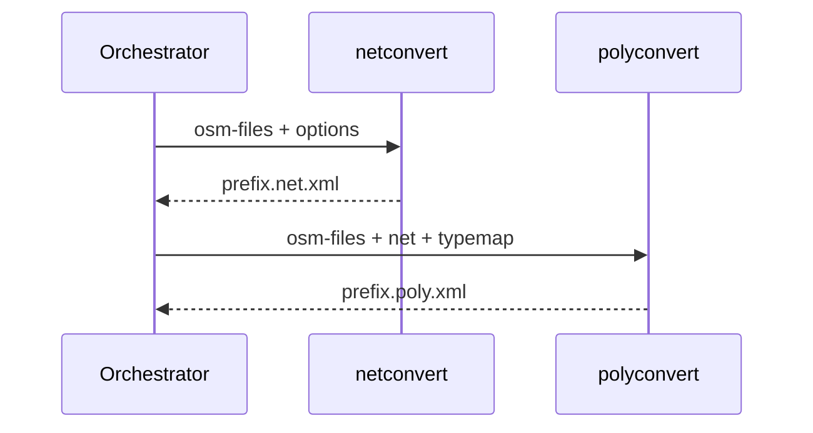
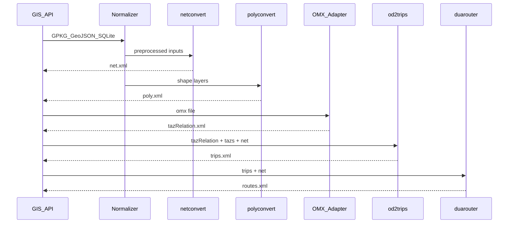
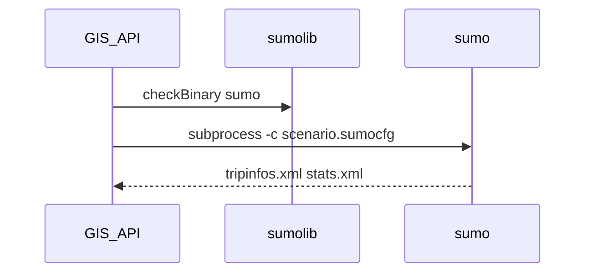
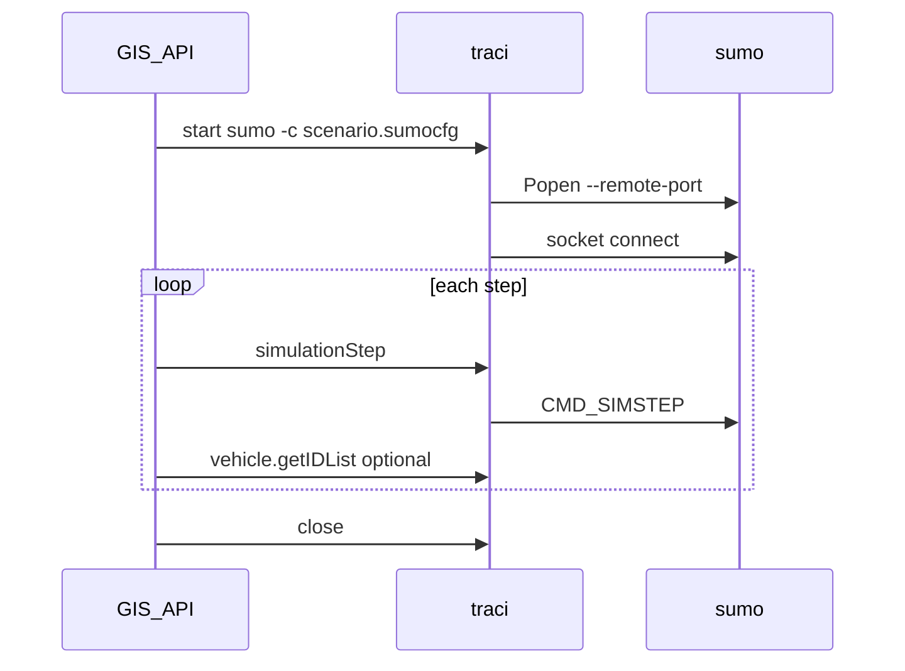

# Interface Registry — SUMO GIS API

Cross-module data contracts. Update when slices complete or implementations change.

Status: `upstream` (existing SUMO), `partial` (exists but incomplete for MVP), `gap` (must be built), `unverified` (hypothesis).

| Interface | Format | Producer | Consumer | Status | Notes |

|---|---|---|---|---|---|

| Network | `.net.xml` | netconvert | sumo, duarouter, polyconvert | upstream | Primary road graph |

| Shapes / additional | `.poly.xml` | polyconvert | sumo-gui | upstream | POIs, polygons |

| TAZ definitions | `tazs` XML | netedit, edgesInDistricts.py | od2trips | upstream | Required for OD demand |

| OD relations | `tazRelation` XML | netedit, route2OD.py, **OMX adapter** | od2trips, routeSampler | partial | OMX path is **gap** |

| Trips | `.trips.xml` | od2trips, randomTrips.py | duarouter | upstream | |

| Routes | `.rou.xml` | duarouter | sumo | upstream | |

| SUMO config | `.sumocfg` | API orchestrator | sumo | partial | osmWebWizard generates via `sumo --save-configuration`; API wrapper **gap** |

| GDAL vector layer | GPKG/GeoJSON/SHP | External GIS | polyconvert; netconvert (lines) | upstream | GPKG via GDAL **unverified** |

| OMX matrix | `.omx` | External planning tools | **OMX adapter** → tazRelation | **gap** | No native SUMO reader |

| SQLite spatial | SpatiaLite / tables | External | API normalization | **unverified** | ADR-013 |

| Typemap | `.typ.xml` | `data/typemap/` | netconvert, polyconvert | upstream | Schema mapping |

| XSD validation | `data/xsd/*.xsd` | SUMO project | all XML tools | upstream | ADR-007 |

| Build config | `.netccfg`, `.polycfg` | orchestrator | netconvert, polyconvert | upstream | osmBuild pattern |

| sumolib binary resolution | executable path | `sumolib.checkBinary` | orchestrator subprocess | upstream | `SUMO_HOME`, `*_BINARY` env; see ADR-006 § sumolib |

| sumolib XML helpers | SUMO XML | orchestrator scripts | disk artifacts | upstream | `writeHeader`, `xml.parse*`; ADR-007 |

| sumolib net read | in-memory `Net` | `sumolib.net.readNet` | validation, geo, routing | upstream | Requires `.net.xml`; optional `pyproj` for lon/lat |

| TraCI connection | TCP socket / libsumo / libtraci | `traci.start` / `traci.connect` | step loop, domain getters | upstream | Socket default; regression in `tests/complex/traci/`, `tests/traci/`; libsumo CI via `complex.libsumo`; fork Option D **unverified** (ADR-015) |

| Fork integration tests | TextTest `*.tools` collateral | `tests/tools/import/gis/` runners | CI `-a tools` | **gap** | Harness contract IF-TEST-001; see `specs/test-strategy.md` |

| TraCI simulation step | sim time advance | `traci.simulationStep` | monitoring clients | upstream | Used by drt/fcdReplay; **not** osmBuild/osmWebWizard |

| Simulation outputs | tripinfo, stats, edgeData XML | sumo (`--tripinfo-output`, etc.) | API / client | upstream | osmWebWizard pattern (`osmWebWizard.py:464–471`) |

---

## Test harness contract (IF-TEST-001)

**Status:** `gap` (stub only — no `tests/tools/import/gis/` yet)

| Field | Convention |
|---|---|
| Runner | `tests/runTests.sh` → TextTest app `tools` (`tests/tools/config.tools`) |
| Entry | `options.tools` → `toolrunner.py` → `tools/import/gis/…` or local `runner.py` |
| Golden files | `output.tools`, `errors.tools`, named `*.tools` per artifact |
| Binaries | `sumolib.checkBinary`; CI sets `SUMO_BINARY` / `SUMO_HOME` via `runTests.sh` |
| CI inclusion | `-a tools` in `linux.yml`, `windows.yml` (extra), `test-wheels.yml` |

Detail: `specs/test-strategy.md`.

---

## Orchestration sequence (reference — osmBuild)

## Target API sequence (MVP — includes demand)

## Target simulation sequence (ADR-015 — workshop)

*Option A (subprocess, recommended v1):*

*Option B (TraCI socket — if workshop selects):*

---

## Reconciliation log

| Date | Change |

|---|---|

| 2026-06-15 | Initial seed from bootstrap plan |

| 2026-06-15 | Slice 1: orchestration interfaces documented in ADR-006 |

| 2026-06-15 | Slices 2–5: GDAL, XSD, OD/OMX gaps recorded |

| 2026-06-15 | Slice 6: sumolib binary/XML/net helpers; TraCI connection + simulation step; `.sumocfg` partial; post-duarouter simulation sequences (ADR-015 target) |
| 2026-06-15 | Slice 6 reconcile: socket TraCI `upstream`; libsumo/libtraci fork paths `unverified`; Option A output `tripinfos.xml`; libsumo `connect` N/A noted |
| 2026-06-15 | Slice 7: TextTest conventions → `specs/test-strategy.md`; TraCI regression confirmed in `tests/complex/traci/` + `tests/traci/`; `checkBinary` CI via `runTests.sh` + `sumolib/init`; IF-TEST-001 stub |
| 2026-06-15 | R2: Tier A ADR-001–007 Accepted; context extraction archived → `specs/archive/context-extraction.md`; gaps G-1–G-8 → Tier B workshop |

