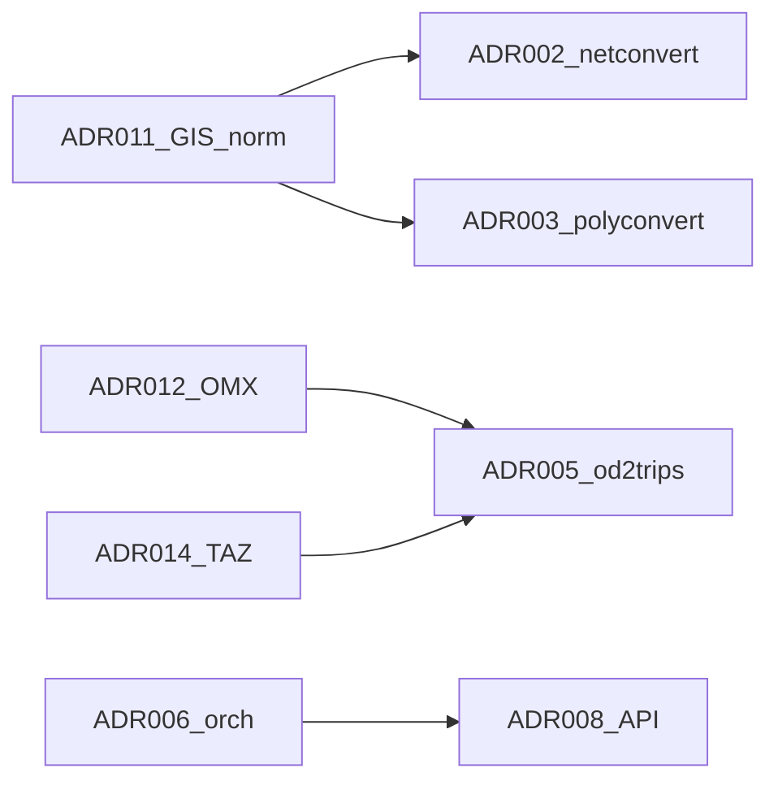

# Reconciliation R1 — Slices 2–5

**Date:** 2026-06-15
**Slices:** Network import, polyconvert, XSD, OD/OMX

## Glossary updates applied

- Network vs shapes distinction reinforced in `specs/glossary.md`.
- OMX / TAZ alignment note added (ADR-014 dependency).

## Interface registry updates

See `specs/interfaces.md` reconciliation log. Key findings:

| Finding | Action |
|---|---|
| GeoJSON network import absent | ADR-002 gap; ADR-011 normalization required |
| GPKG via GDAL unverified | Status `unverified` on interfaces table |
| OMX native support absent | Status `gap`; ADR-012 workshop |
| tazRelation partial | OMX adapter is new producer |

## Tier A ADR status

| ADR | Slice | Ready for Accept after R2 |
|---|---|---|
| ADR-001 | Module map | Yes (with R2) |
| ADR-002 | netimport | Yes |
| ADR-003 | polyconvert | Yes (GPKG caveat documented) |
| ADR-004 | GDAL | Yes |
| ADR-005 | OD/OMX | Yes |
| ADR-006 | orchestration + sumolib/TraCI | Yes (slice 6) |
| ADR-007 | XSD | Yes |

## Tier B workshop pack

Workshop required before API implementation. See:

- ADR-008 through ADR-015 in `specs/adrs/`
- `specs/workshop-tier-b.md` — decision checklist for Pablo

## Cross-slice dependencies

## Slice 6 reconcile (ADR-006 extensions)

**Date:** 2026-06-15  
**Verified against:** ADR-015, `interfaces.md` simulation sequences, glossary TraCI/Libsumo/Libtraci.

| Finding | Action applied |
|---|---|
| TraCI status `upstream` vs ADR-006 `unverified` | ADR-006: socket TraCI `upstream` (`tests/complex/traci/`, `tests/traci/`); libsumo CI in `test-wheels.yml`; fork Option D `unverified` until ADR-015 |
| Misleading “no TraCI tests” | ADR-006 consequences reworded — no `tests/tools/traci/`; coverage in `tests/complex/traci/` and `tests/traci/` |
| `traci.connect` vs Libsumo | `interfaces.md` TraCI row: `connect`/`init` N/A when `LIBSUMO_AS_TRACI=1` |
| Option D libtraci missing | ADR-006 flowchart: `LIBTRACI_AS_TRACI` branch added |
| `tripinfo.xml` vs `tripinfos.xml` | `interfaces.md` Option A sequence corrected |
| `libsumo.start` not in ADR-006 lifecycle | Connection lifecycle table row added |
| Workshop checklist libtraci | `workshop-tier-b.md` ADR-015 lists libsumo or libtraci |

## Next steps (post–R2)

Context extraction complete — see [reconciliation-r2.md](reconciliation-r2.md). Tier B workshop: [workshop-tier-b.md](workshop-tier-b.md).
