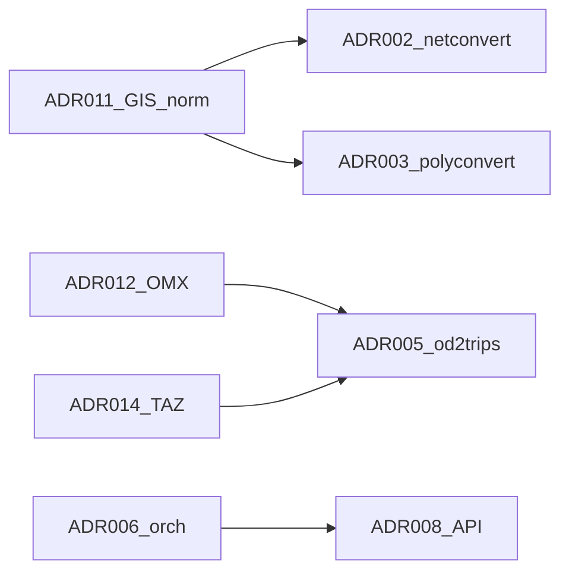

# Reconciliation R1 — Slices 2–5

**Date:** 2026-06-15
**Slices:** Network import, polyconvert, XSD, OD/OMX

## Glossary updates applied

- Network vs shapes distinction reinforced in `specs/glossary.md`.
- OMX / TAZ alignment note added (ADR-014 dependency).

## Interface registry updates

See `specs/interfaces.md` reconciliation log. Key findings:

| Finding | Action |
|---|---|
| GeoJSON network import absent | ADR-002 gap; ADR-011 normalization required |
| GPKG via GDAL unverified | Status `unverified` on interfaces table |
| OMX native support absent | Status `gap`; ADR-012 workshop |
| tazRelation partial | OMX adapter is new producer |

## Tier A ADR status

| ADR | Slice | Ready for Accept after R2 |
|---|---|---|
| ADR-001 | Module map | Yes (with R2) |
| ADR-002 | netimport | Yes |
| ADR-003 | polyconvert | Yes (GPKG caveat documented) |
| ADR-004 | GDAL | Yes |
| ADR-005 | OD/OMX | Yes |
| ADR-006 | orchestration | Yes (slice 1) |
| ADR-007 | XSD | Yes |

## Tier B workshop pack

Workshop required before API implementation. See:

- ADR-008 through ADR-015 in `specs/adrs/`
- `specs/workshop-tier-b.md` — decision checklist for Pablo

## Cross-slice dependencies

## Next slices (pending)

- Slice 6: `tools/sumolib/` — extend ADR-006
- Slice 7: `tests/`, CI conventions
