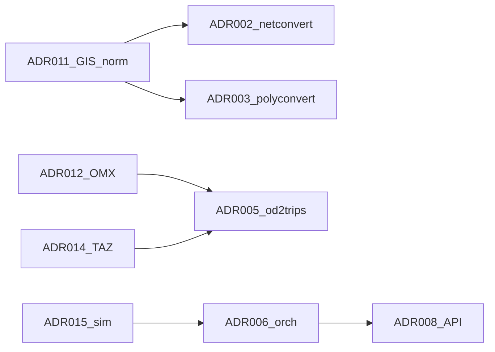

# Reconciliation R2 — Context Extraction Complete

**Date:** 2026-06-15  
**Scope:** Slices 1–7 + R1 cross-check; Tier A ADR promotion; Tier B workshop pack pointer

## Summary

Context extraction (slices 0–7, R1, R2) is **complete**. Tier A ADRs **001–007** promoted to **Accepted (documented from code)**. Tier B ADRs **008–015** remain **Draft** pending Pablo's workshop ([workshop-tier-b.md](workshop-tier-b.md)).

**Next gate:** Tier B workshop → first OpenSpec implementation change (e.g. `gis-api-mvp`).

---

## Reconcile checks

| Check | Result |
|---|---|
| Glossary term conflicts | **None** — network vs shapes, OMX/TAZ, TraCI/Libsumo terms consistent |
| Interface registry duplicates | **None** — IF-TEST-001 added slice 7; TraCI row aligned with ADR-006 |
| ADR cross-references | **OK** — ADR-012→005, ADR-014→005, ADR-011→002/003, ADR-006→015 Option D caveat |
| Coverage ledger vs ADR files | **Aligned** — registry and ADR headers updated |
| Slice open questions | **Documented as caveats** — not blockers for Tier A acceptance |

---

## Tier A promotion (Accepted — documented from code)

| ADR | Slice(s) | Accepted with caveats |
|---|---|---|
| ADR-001 | 0, module map | — |
| ADR-002 | 2 | GeoJSON network import absent → ADR-011 gap |
| ADR-003 | 3 | GPKG via GDAL **unverified** in interfaces |
| ADR-004 | 2, 4 | Optional GDAL build |
| ADR-005 | 5 | OMX native path absent → ADR-012 |
| ADR-006 | 1, 6, 7 | Demand steps beyond osmBuild; libsumo/libtraci fork adoption → ADR-015 |
| ADR-007 | 4 | — |

---

## Slice ledger — final status

| Slice | Status | Notes |
|---|---|---|
| 0 Bootstrap | **Accepted** | — |
| 1 Orchestration | **Accepted** | Demand pipeline deferred to API (documented in ADR-006) |
| 2 Network import | **Accepted** | GeoJSON gap recorded |
| 3 Shape import | **Accepted** | GPKG unverified |
| 4 Data contracts | **Accepted** | — |
| 5 OD / demand | **Accepted** | OMX → ADR-012 |
| R1 Reconcile | **Accepted** | [reconciliation-r1.md](reconciliation-r1.md) |
| 6 sumolib + TraCI | **Accepted** | Socket TraCI upstream; Option D unverified |
| 7 Tests / CI | **Accepted** | [test-strategy.md](test-strategy.md); fork tests not implemented |
| R2 Reconcile | **Accepted** | This document |

Full historical schedule: [archive/context-extraction.md](archive/context-extraction.md).

---

## Documented gaps (workshop / implementation — not Tier A blockers)

| ID | Topic | Owner | Notes |
|---|---|---|---|
| G-1 | GPKG import path | ADR-011 workshop | `interfaces.md`: GDAL vector **unverified** for GPKG |
| G-2 | OMX → tazRelation | ADR-012 workshop | Native SUMO has no OMX reader |
| G-3 | SQLite / SpatiaLite | ADR-013 workshop | **unverified** |
| G-4 | TAZ ↔ OMX zone ids | ADR-014 workshop | Glossary reconciliation note |
| G-5 | Simulation execution | ADR-015 workshop | subprocess vs TraCI vs libsumo/libtraci |
| G-6 | HTTP API + job model | ADR-008 workshop | — |
| G-7 | REST contract | ADR-010 workshop | — |
| G-8 | Fork integration tests | Post-MVP | IF-TEST-001; HTTP harness TBD (test-strategy T7-1) |

---

## Tier B workshop pack

Work through [workshop-tier-b.md](workshop-tier-b.md) in order. Draft ADRs ready for decisions:

| ADR | Decision needed |
|---|---|
| ADR-008 | Framework, job model, packaging |
| ADR-009 | Upstream contribution intent (path/tests **Accepted**) |
| ADR-010 | REST resources, upload limits, GPKG layer selection, auth deferral |
| ADR-011 | geopandas vs GDAL CLI; CRS policy |
| ADR-012 | tazRelation vs V-format; openmatrix; time slices |
| ADR-013 | SpatiaLite vs plain SQLite |
| ADR-014 | OMX zone id matching; polygon layer convention |
| ADR-015 | subprocess sumo vs TraCI vs libsumo/libtraci; artifact storage |

After workshop: update ADR files + [adr-registry.md](adr-registry.md) → `/sumo-propose gis-api-mvp`.

---

## Cross-slice dependency graph (unchanged from R1)

---

## Artifacts updated in R2

- `specs/adrs/ADR-001` … `ADR-007` — status → Accepted
- `specs/adr-registry.md` — Tier A rows
- `specs/coverage.md` — extraction complete pointer
- `specs/archive/context-extraction.md` — archived ledger
- `specs/test-strategy.md` — Accepted (brownfield section)
- `specs/interfaces.md` — reconciliation log entry
- `specs/reconciliation-r1.md` — next-steps note trimmed
