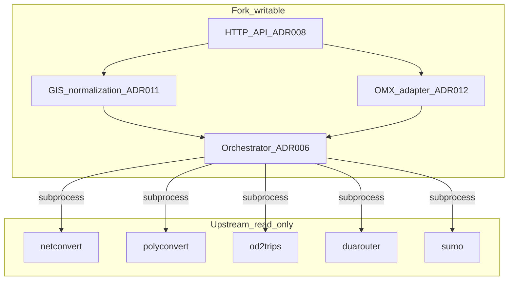

# Architecture — SUMO GIS API Fork

**Consult this file before implementing code.** See also `AGENTS.md` § Architecture and writable roots.

---

## Two layers in one repository

| Layer | Role | Agent policy |
|---|---|---|
| **Upstream SUMO** | `src/`, `tools/` (existing), `data/`, `docs/`, `tests/` (upstream) | **Read-only** — reference, slice extraction, subprocess invocation |
| **Fork (GIS API)** | New modules under writable roots (below) | **Read/write** — all new product code |

Upstream SUMO is **not** hexagonal or DDD. It is a **multi-binary, file-based pipeline toolkit**:

- **Modular C++ core** (`src/`) — compile-time modules, many executables (`netconvert`, `polyconvert`, `sumo`, `od2trips`, `duarouter`, …). See [Sumo_Modules.md](../../docs/web/docs/Developer/Implementation_Notes/Sumo_Modules.md).
- **Python orchestration** (`tools/`, `sumolib`) — subprocess + saved config files (`.netccfg`, `.polycfg`). Reference: [`tools/osmBuild.py`](../../tools/osmBuild.py).
- **Integration contracts** — XML on disk validated against `data/xsd/`; TraCI for runtime control.

## Target architecture (this project)

**Facade + process orchestrator** over unchanged SUMO binaries:

- **No edits** to existing files under `src/` or `tools/`.
- **No** embedding in `sumolib` or patching `osmBuild.py`.
- Integration only via **subprocess**, **temp/working files**, and **XML artifacts** (`specs/interfaces.md`).

---

## Writable roots (allowlist)

Default **deny** for `src/` and `tools/`. Only these paths are fork-owned:

| Path | Purpose |
|---|---|
| `tools/import/gis/**` | GIS import module, OMX adapter, orchestration library, HTTP app (ADR-009) |
| `tests/tools/import/gis/**` | Tests for the above |
| `specs/**` | PRD, ADRs, standards, interfaces |
| `ai/**` | Canonical AI assets |
| `openspec/**` | OpenSpec changes (except generated opsx skills under `.claude/`) |
| `scripts/sync_ai.py` | AI sync generator |

To add a new writable root (e.g. second package), update this file, `AGENTS.md`, and `ai/context/key-files.md` in the same change — do not assume agents infer new paths.

### Not writable (examples)

| Path | Why |
|---|---|
| `tools/import/gtfs/**`, `tools/import/visum/**`, … | Existing upstream import pipelines |
| `tools/osmBuild.py`, `tools/sumolib/**` | Upstream orchestration / library |
| `src/**` | C++ core — out of scope for v1 |
| Entire `tools/import/` | **Parent folder is mixed** — only `tools/import/gis/` is green |

---

## When developing

1. Read `AGENTS.md` hard rules and this file.
2. Read `specs/prd.md` and relevant ADRs.
3. Implement only under writable roots.
4. Invoke SUMO via `sumolib.checkBinary` (ADR-006) — never fork upstream scripts.

## References

- ADR-001 (module map), ADR-006 (orchestration), ADR-009 (placement)
- PRD §1
