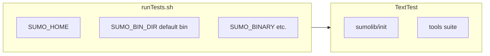

# Test Strategy — SUMO GIS API Fork

**Status:** Accepted (documented from code — slice 7)
**Scope:** How the fork adds tests under writable roots without modifying upstream `tests/` layout.

Upstream test mechanics: [docs/web/docs/Developer/Tests.md](../docs/web/docs/Developer/Tests.md) (point, don't duplicate).

---

## Summary

| Layer | Harness | Location | Fork policy |
|---|---|---|---|
| C++ unit tests | CTest | `cmake-build` (`make test`) | Read-only reference |
| Python tools integration | TextTest | `tests/tools/**` | **New tests only** under `tests/tools/import/gis/**` |
| Python complex integration | TextTest | `tests/complex/**` | Read-only reference |
| TraCI protocol regression | TextTest | `tests/traci/**` | Read-only reference |
| TraCI Python regression | TextTest | `tests/complex/traci/**` | Read-only reference |
| GIS API fork tests | TextTest (+ optional `unittest`) | `tests/tools/import/gis/**` | **Not implemented yet** (ADR-009) |

---

## Upstream harness: TextTest

SUMO acceptance tests use [TextTest](https://texttest.org/) 4.x. `tests/runTests.sh` sets `TEXTTEST_HOME`, `SUMO_HOME`, `LC_ALL=C`, and `*_BINARY` environment variables, then invokes `texttest`.

### Application configs

Each test family has a `config.<app>` file (e.g. `tests/tools/config.tools`, `tests/complex/config.complex`) that:

- Imports shared rules from `tests/config_all`
- Names the interpreter or binary (`toolrunner.py` for tools)
- Lists `copy_test_path` fixtures inherited along the folder hierarchy
- Defines `[collate_file]`, `[run_dependent_text]`, and `[floating_point_tolerance]` for stable diffs

### Per-test file roles (`tests/tools/`)

| File | Role |
|---|---|
| `options.tools` | Arguments passed to the tool under test (first token is often a script path under `tools/`) |
| `output.tools` | Expected stdout |
| `errors.tools` | Expected stderr (warnings, unittest summary, etc.) |
| `<name>.tools` | Additional output artifacts (e.g. `net.tools`, `routes.tools`, `additional.tools`) |
| `runner.py` | Optional Python driver when logic exceeds a one-liner CLI invocation |
| `testsuite.tools` | Suite index — lists subdirectories to include |
| `testsuite.tools.ci` | CI subset (e.g. `tests/tools/import/OSM/testsuite.tools.ci` excludes heavy `webWizard`) |

`tests/toolrunner.py` resolves `.py` / `.jar` tools and runs them with the active Python interpreter (`-Wd` on Python 3).

### sumolib conventions (`tests/tools/sumolib/`)

Two patterns coexist:

1. **Integration (majority):** `options.tools` invokes `runner.py`; stdout/stderr captured in `output.tools` / `errors.tools`. Example: `tests/tools/sumolib/net/`.
2. **Unit tests:** `unittest` in `runner.py`; stderr captured in `errors.tools` (e.g. `Ran N tests … OK`). Examples: `init/`, `miscutils/`, `geomhelper/`, `sumolib3d/`.

The `init` suite deliberately appends the repo `tools/` tree (not `SUMO_HOME`) so `checkBinary` tests always exercise the co-located sumolib sources.

### Import-tool conventions (`tests/tools/import/`)

Import pipelines mirror the tools pattern:

- Top-level `tests/tools/import/testsuite.tools` lists format families (`visum`, `OSM`, `GTFS`, `dxf`, …).
- Each scenario folder holds fixtures (`net.net.xml`, `gtfs.zip`, `osm_bbox.osm.xml`, …) plus `options.tools` pointing at `tools/import/<format>/…py`.
- Multi-step orchestration tests (OSM `webWizard`) use **named collateral** files (`osmimport.tools`, `osmbatch.tools`, `osmtrips.tools`, …) collated by `tests/tools/config.tools`.
- **No `unittest`** usage under `tests/tools/import/` — integration-only.

**Reference for fork:** `tests/tools/import/GTFS/` (single-tool CLI) and `tests/tools/import/OSM/webWizard/` (multi-binary orchestration akin to GIS API).

---

## `checkBinary` in tests and CI

### Regression test

`tests/tools/sumolib/init/runner.py` (`Test_Init.test_checkBinary`) asserts resolution order:

1. `SUMO_BINARY` env → exact path
2. After unset: path containing `sumo`
3. After unset `SUMO_HOME`: wheel install (`import sumo`) or bare name with empty `bindir`

Stderr expectation: `errors.tools` records the unittest summary (`Ran 2 tests … OK`).

### CI wiring



| Workflow | Relevant step | `checkBinary` context |
|---|---|---|
| [`.github/workflows/linux.yml`](../.github/workflows/linux.yml) | `Plain tests`: `runTests.sh -b ci -v ci` | Built binaries in `$SUMO_HOME/bin`; `tools` included in default app set |
| [`.github/workflows/windows.yml`](../.github/workflows/windows.yml) | `complex, traci and tools tests` (`build_type: extra`) | `$PATH` includes `bin/` before `-a complex,traci,tools` |
| [`.github/workflows/test-wheels.yml`](../.github/workflows/test-wheels.yml) | `SUMO_BIN_DIR=$(python -c … dirname(sys.executable))` | Wheel wrapper binaries; `-a complex,tools,traci` with `-v ci.fast` |

**Fork implication:** GIS orchestration tests SHOULD resolve binaries via `sumolib.checkBinary` (ADR-006) and rely on CI env vars set by `runTests.sh` — no custom binary discovery in fork tests.

---

## TraCI regression tests (presence / absence)

| Path | Present | Purpose |
|---|---|---|
| `tests/complex/traci/` | **Yes** (~2000 files) | Python TraCI client integration; `runner.py` + `sumolib.checkBinary('sumo')` + `traci.start(…)` |
| `tests/traci/` | **Yes** | Protocol-level variable get/set/subscription tests (`testclient.prog`, `*.traci` collateral) |
| `tests/tools/traci/` | **No** | TraCI is not tested as a `tools/` TextTest app |
| `tests/tools/sumolib/` | Partial | No TraCI client tests; only sumolib library surface |

**Libsumo / libtraci CI (upstream):**

- `test-wheels.yml` runs `runTests.sh -b ci -v ci -a complex.libsumo` after installing libsumo wheels.
- Overlay configs `tests/complex/config.complex.libsumo` and `config.complex.libtraci` normalize stderr/stdout diffs when `LIBSUMO_AS_TRACI` / `LIBTRACI_AS_TRACI` is set.
- Sub-suites such as `tests/complex/traci/bugs/testsuite.complex.libsumo.ci` gate libsumo-specific expectations.

**Fork implication (ADR-015):** Reuse upstream TraCI coverage for socket client behaviour. New fork tests are **not required** for TraCI unless the API adopts libsumo/libtraci (Option D) — then follow upstream `complex.libsumo` / `config.complex.libtraci` patterns; fork adoption remains **unverified** until ADR-015 workshop.

---

## CI workflows relevant to the fork

| Workflow | GIS API relevance |
|---|---|
| `linux.yml` / `windows.yml` / `macos.yml` | Full upstream regression; fork PRs inherit `tools` suite when GIS tests are added |
| `test-wheels.yml` | Documents wheel + `checkBinary` + reduced `ci.fast` matrix |
| `documentation.yml`, `docker.yml`, wheels jobs | Low direct relevance for v1 GIS module |

No dedicated GIS workflow is planned. New tests under `tests/tools/import/gis/**` are picked up automatically by `-a tools` (see `tests/filter_files/linux_failures.txt`: `appdata=tools`).

---

## Fork test plan (stub — not implemented)

**Writable root:** `tests/tools/import/gis/**` (ADR-009). **Do not edit** sibling `tests/tools/import/*` trees.

### Planned structure

```
tests/tools/import/gis/
├── testsuite.tools          # index scenarios
├── testsuite.tools.ci       # optional CI subset for slow OMX/GPKG cases
└── <scenario>/
    ├── options.tools        # CLI to tools/import/gis/… or runner.py
    ├── output.tools / errors.tools
    ├── runner.py            # when orchestration steps need scripting
    └── fixtures/…           # small GeoJSON, SQLite, OMX samples
```

### Test categories (future)

| Category | Harness | Notes |
|---|---|---|
| Normalization unit | `unittest` in `runner.py` or pure pytest TBD | CRS / geometry edge cases (ADR-011) |
| OMX adapter | TextTest | Output `tazRelation` XML vs golden file (ADR-012) |
| Orchestration | TextTest | Multi-collateral like OSM `webWizard` — `net.tools`, `poly.tools`, `trips.tools` |
| API HTTP | **Deferred** | ADR-010 / ADR-008 — likely separate harness (not TextTest) |

### Conventions to follow

- SPDX header on new `runner.py` files (match upstream).
- Use `[run_dependent_text]` overrides in a fork-local `config.tools` fragment only if needed; prefer shared rules in `tests/tools/config.tools` patterns.
- Strip timestamps / paths via existing `config.tools` collate rules where possible.
- Keep fixtures minimal; large rasters belong in `tests/complex` style `data/` merges, not committed blobs.

---

## Open questions

| ID | Question | Blocker |
|---|---|---|
| T7-1 | HTTP API tests: TextTest vs `pytest` + `httpx` | ADR-008 workshop |
| T7-2 | GPKG / GDAL-dependent scenarios: require `polyconvert.gdal.ci` matrix or skip flags | ADR-011, GDAL availability |
| T7-3 | OMX golden files: synthetic minimal matrix vs sampled real file | ADR-012 |
| T7-4 | libsumo/libtraci fork smoke test needed? | ADR-015 |

---

## References

- ADR-006 (`checkBinary`, orchestration), ADR-009 (test placement)
- `specs/standards/python-standards.md` — fork Python conventions
- `specs/interfaces.md` — `IF-TEST-001` harness contract
- Slice ledger: `specs/coverage.md`
